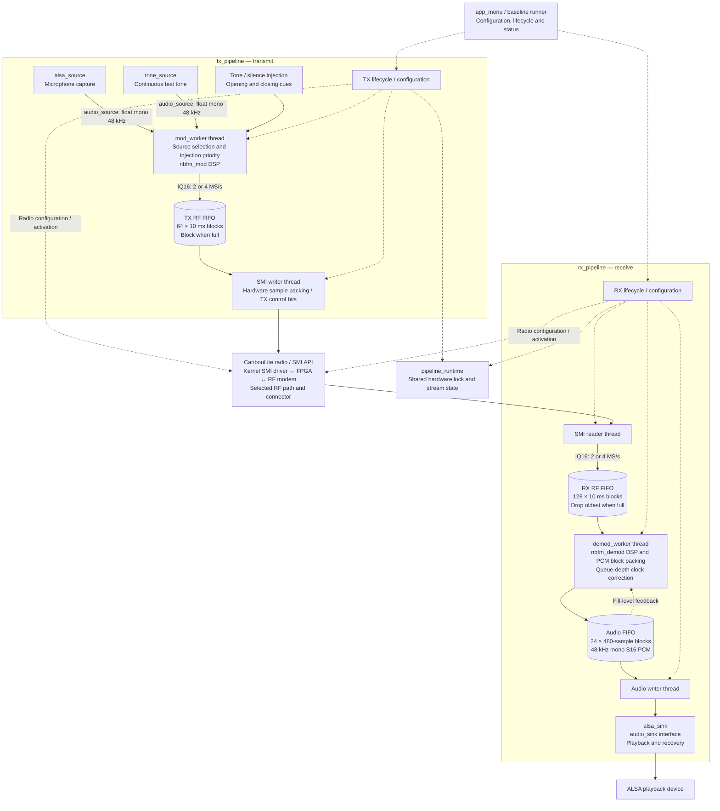
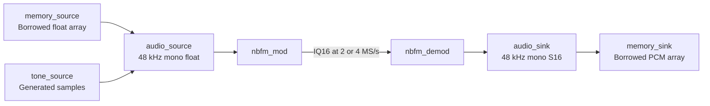

# Audio and DSP module interfaces

Living reference for the [incremental refactoring plan](audio-dsp-refactor-plan.md).
Status: steps 1–8 implemented. Implemented sections below are authoritative;
the original proposed contracts remain design history. See the
[extension guide](audio-dsp-extension-guide.md) for composition and future modems.
Update this file with every interface-changing increment.

## Current implementation

| Module | Inputs / outputs | Current coupling |
| --- | --- | --- |
| `audio_source.h` | Format + read-result + destroy operations | Common source boundary; used by ALSA, tone and memory sources |
| `alsa_source.c/.h` | ALSA capture -> mono float audio at 48 kHz | Owns capture handle, conversion and buffering; used by TX |
| `tone_source.c/.h` | Frequency/amplitude -> 48 kHz mono float audio | Common source implementation for TX, injection and self-test tones |
| `memory_audio.c/.h` | Borrowed float input / S16 output arrays | Finite nonblocking adapters; no devices or workers |
| `nbfm_memory_demo.c` | Source -> NBFM IQ -> PCM -> sink | Standalone composition; C and math only |
| `nbfm_mod.c/.h` | Float audio -> packed signed 16-bit I/Q pairs | Explicit progress/reset/error contract; 48 kHz mono and 2 or 4 MS/s IQ |
| `audio_sink.h`, `alsa_sink.c/.h` | Mono S16 PCM at 48 kHz -> ALSA playback | Sink owns PCM configuration, stereo fallback, recovery and close |
| `nbfm_demod.c/.h` | IQ16 -> mono S16 PCM | Standalone stateful DSP; caller supplies fractional rate correction |
| `demod_worker.c/.h` | Application IQ FIFO -> application audio FIFO | Owns 480-frame packing, FIFO-depth servo, diagnostics and thread entry |
| `audio_format.h` | Rate/channels, normalized float and S16 PCM sample types | Shared definitions without implicit conversion |
| `iq16.h` | Packed signed 16-bit I then Q | Shared existing IQ layout; no device dependencies |
| `pipeline_transport.c/.h` | RF/audio frames and FIFO operations | Internal synchronized queues, timeouts, statistics and cancellation cleanup |
| `pipeline_runtime.c/.h` | Hardware lock, stream flags, monotonic time and scheduling | Shared process-wide application runtime |
| `tx_pipeline.c/.h`, `mod_worker.c/.h` | Audio source -> modulator -> RF FIFO -> SMI | TX allocation, workers, injection, hardware lifecycle and status |
| `rx_pipeline.c/.h` | Radio -> RF FIFO -> demod worker -> audio FIFO -> sink | RX allocation, reader/playback workers, hardware lifecycle and status |
| `modem_selftest.c/.h` | Generated audio -> modulator -> demod worker -> playback | Option 13 orchestration without menu dependencies |
| `app_pipeline_internal.h` | Compatibility include | Retained for frozen test fixtures; production uses transport/runtime headers |
| `app_menu.c` | UI, configuration and radio controls | Selects routes/settings, calls pipeline APIs and renders status |

Both DSP modules expose creation, processing progress, reset and destruction.
The modulator also retains its legacy push/pull APIs. Their reset and buffering
semantics remain explicit and module-specific, preserving existing signal behavior.

## Current radio architecture

Solid arrows carry samples; dotted arrows show control or feedback. The TX and
RX groups show pipeline ownership. Each worker box is one thread; its DSP calls
run in that same thread. The diagram shows the NBFM streaming paths, not every
legacy diagnostic menu option.



`pipeline_transport` implements the three application FIFOs shown above. Each
RF block holds 20,000 IQ pairs at 2 MS/s or 40,000 at 4 MS/s. TX source reads use
480 audio samples per block; there is no separate application audio FIFO before
the modulator. ALSA buffering and kernel/FPGA transport buffers are internal to
their respective layers and are not expanded here. The TX/RX paths share one
device and runtime; this diagram does not imply simultaneous duplex operation.

### Hardware-free adapter composition

Memory adapters currently connect through the standalone demo, not through the
production pipeline constructors. This path uses the same source/sink contracts
and DSP modules, with synchronous calls and no worker threads or FIFOs. The tests
also substitute a live `tone_source` for the memory source.



Option 13 is a separate composition in `modem_selftest`: generated audio passes
through NBFM modulation and the demodulation worker, then a 64-block self-test
audio FIFO feeds the playback worker and ALSA sink. It exercises DSP and playback
without traversing the RF hardware path. See the
[extension guide](audio-dsp-extension-guide.md) for runnable offline examples.

## Target data paths

```text
TX pipeline: audio_source.read -> nbfm_mod.process -> radio write
RX pipeline: radio read -> nbfm_demod.process -> audio_sink.write
```

`alsa_source` and `tone_source` implement the source contract. `alsa_sink`
implements the sink contract. `memory_audio` implements both for offline use.
File and network adapters remain future extensions.
Pipeline workers own pacing, queues, hardware-specific sample conversion and
coordination; DSP owns signal-processing state only.

## Proposed boundary contracts

These rules guide implementation. Record exact C declarations and supported
values here when each interface lands; do not treat these as existing guarantees.

### Audio source and sink

- Describe sample rate in Hz and channel count explicitly. Initially support
  mono float audio at exactly 48 kHz; reject unsupported configurations.
- Use nominal normalized float audio with a documented scale. Preserve current
  capture gain and TX amplitude. Define conversion/clipping at the sink when
  moving the current signed-16-bit RX audio output to the shared float format.
- Counts are audio frames, not bytes; one frame contains one sample per channel.
- Caller owns sample buffers. A read fills a caller buffer; a write consumes a
  caller buffer. Adapters must not retain that pointer after returning.
- Report actual transfer count separately from status. Specify partial transfer,
  end-of-stream, timeout/would-block, stopped and fatal-error behavior explicitly.
- Specify blocking and interruption behavior so shutdown has a bounded path.
- One pipeline worker owns each adapter. Close after its worker has stopped;
  document any operation explicitly allowed from the control thread.

### Modulator and demodulator

- Explicit configuration includes audio rate, IQ rate, deviation and applicable
  filtering/gain parameters. Document supported values and defaults, with units.
- Processing accepts input length and output capacity, and returns consumed and
  produced counts plus status. Buffered input/output and no-progress conditions
  must be documented so callers cannot spin or silently drop samples.
- Preserve state between blocks. Define reset separately from destruction and
  document which filter, phase and resampling states it clears.
- Use a shared IQ sample type with explicit I/Q order, signedness and scale.
  Initially preserve existing signed-16-bit IQ values; hardware control bits
  belong in radio transport conversion, not in generic DSP output.
- No ALSA handles, application FIFOs, radio access, UI calls or thread scheduling
  in DSP. Configuration updates and processing have one serialized owner.
- Allocate persistent storage at creation; document any processing-time allocation.
- The RX pipeline measures output-buffer fill and supplies clock correction.
  Preserve existing correction limits and timing during extraction; document the
  correction's sign and units. The demodulator need not know the destination.

### Pipeline coordination

- Own worker threads, transport queues, backpressure and radio activation order.
- Connect configured source/sink to a modem; validate compatible formats before
  starting hardware. No implicit arbitrary-rate or multichannel support.
- Distinguish requested stop, adapter failure and hardware failure. Define how
  blocked I/O is released, workers are joined and resources are destroyed.
- Preserve current restart/retune behavior and tested TX shutdown deadlines.
- Publish status for the UI without exposing mutable DSP internals.

## Documentation required for each implemented interface

For each module, add: header and implementation links, exact API declarations,
configuration/defaults, sample format and units, buffer/state ownership, thread
rules, partial-transfer/error semantics, reset/stop behavior, dependencies and a
short caller example. Link its software checks and physical checkpoint evidence.

## Decisions and remaining scope

Transfer counts/status and cancellation are documented in the implemented source
and sink sections. Tone phase and injection behavior were preserved. Sources
remain float and sinks remain S16 to retain existing PCM samples; implicit float
normalization was not introduced. Both DSP modules now specify progress,
buffering, reset and errors. A common modem operations interface is deferred
until a second actual modem establishes its requirements. Production adapter
selection remains in the pipeline constructors; the offline example demonstrates
composition without introducing a public live-pipeline injection API.

## Implemented: ALSA capture adapter (step 1)

[Header](../software/libcariboulite/src/alsa_source.h) and
[implementation](../software/libcariboulite/src/alsa_source.c).
Step 1 renames the module and API only; it does not implement the proposed
common audio-source contract above or add configurable sample rates.

```c
typedef struct alsa_source alsa_source_t;
alsa_source_t* alsa_source_create(const char* device, float gain);
size_t alsa_source_read(alsa_source_t* s, float* dst, size_t max_frames);
void alsa_source_destroy(alsa_source_t* s);
```

- Creation opens blocking ALSA capture; a null device selects `default`.
  Configuration remains exactly 48 kHz mono, signed 16-bit little-endian input.
  Creation returns null on initialization failure.
- Output is mono float audio: input divided by 32768, multiplied by `gain`,
  and clipped to [-1, 1]. Counts are audio frames (one float per frame).
- The caller owns `dst`; the adapter writes at most `max_frames` samples and
  does not retain the pointer. Reads return the actual count, possibly short or
  zero. Errors are not reported separately from lack of samples.
- Reads drain the internal ring and attempt up to eight capture calls as needed.
  Blocking ALSA reads and suspend recovery mean this is not a guaranteed wall-clock
  timeout. Overflow drops the oldest buffered audio.
- One worker reads a source. The implementation also shares a static conversion
  buffer across instances, so concurrent reads from different instances are not
  supported. Stop/join the reading worker before destruction; destroy accepts null.
- The adapter owns the PCM handle and capture/ring storage. It depends on ALSA
  and the C runtime, not radio or modem code. There is no public reset operation.

Typical caller (inside the owning audio worker):

```c
alsa_source_t* source = alsa_source_create("plughw:Loopback,1,1", 1.0f);
if (source) {
    float audio[480];
    size_t frames = alsa_source_read(source, audio, 480);
    /* Feed only `frames` valid samples to the modulator. */
    alsa_source_destroy(source);
}
```

Validation: application build and `test_rx_lifecycle.py`; the implementation is
unchanged apart from names. The [step 1 physical retest](baselines/20260919T075122.967948Z/summary.json)
also completed successfully; Jan confirmed all tones at the correct pitch.

## Implemented: common audio source (step 2)

[Interface](../software/libcariboulite/src/audio_source.h). TX now holds an
`audio_source_t*` and calls `audio_source_read` / `audio_source_destroy`.
ALSA construction remains adapter-specific:

```c
audio_source_t* alsa_source_open(const char* device, float gain,
                                audio_format_t format);
```

The format contains `sample_rate` (Hz) and `channels`. Samples are interleaved
normalized floats, with counts in frames. `alsa_source_open` accepts only
`{48000, 1}`; other formats return NULL with `errno = EINVAL` before opening
hardware. Initialization failures return NULL with `errno = EIO`. The legacy
step 1 API remains available, but app capture no longer calls it directly.

A read returns `{frames, status, error}`. Only `frames` samples per channel are
valid; the caller owns storage and the adapter retains no pointer. `OK` can be a
short read. `AGAIN` means no samples presently available; `EOF` means source end;
`ERROR` includes a negative errno-style code. A final/error result may include
valid buffered frames. ALSA never returns EOF; its unrecovered capture failures
return ERROR with any buffered samples. Zero-length reads succeed without I/O;
invalid source/buffer arguments return ERROR/-EINVAL.

The TX worker retries AGAIN/short reads to fill its existing 480-frame block.
On ERROR or EOF it drops the unfinished block, logs failure and clears the TX
stream-active flag; normal pipeline stop/destroy performs final cleanup.
This avoids indefinite retries after a permanent capture failure. Existing
Quindar generation and normal sample conversion are unchanged.

The source has immutable format and operations pointers; an adapter embeds it
and implements read/destroy. No common factory, audio resampler or source-switch
logic is introduced yet. Step 3 replaces the old `audio48k_source` tone interface with `tone_source`. DSP modules do not depend on this I/O interface.

Blocking behavior is still adapter-specific: ALSA uses the existing blocking
reads, recovery, and worker cancellation. No new timeout or cross-thread stop API
is claimed. One reader owns the adapter; stop/join it before destroy. ALSA's
shared conversion buffer still excludes concurrent reads across instances.

```c
audio_source_t* source = alsa_source_open("plughw:Loopback,1,1", 1.0f,
                                         (audio_format_t){48000, 1});
if (source) {
    float block[480];
    audio_source_result_t r = audio_source_read(source, block, 480);
    /* Consume r.frames; handle r.status before requesting more. */
    audio_source_destroy(source); // after the reader has stopped
}
```

Software checks: `test_audio_source.py` scripts ALSA capture without hardware to
check format rejection, partial/error results, scaling and buffered reads;
application build, lifecycle and TX-stop tests also pass. H1 run `20260919T075807.545875Z` completed successfully. Jan confirmed correct
tones/pitch and microphone modulation at both RF rates. The runner's start/stop
cycles passed; additional manual repeated toggles were not separately reported.
[Physical results](baselines/20260919T075807.545875Z/summary.json).

## Implemented: tone source (step 3)

[Header](../software/libcariboulite/src/tone_source.h) and
[implementation](../software/libcariboulite/src/tone_source.c).

```c
audio_source_t* tone_source_open(float frequency, float amplitude,
                                audio_format_t format);
int tone_source_set(audio_source_t* source, float frequency, float amplitude);
audio_source_t* tone_source_open_cue(float frequency);
```

The regular source accepts 48 kHz mono, finite frequency in [0, 24000) Hz and
amplitude in [0, 1]. Invalid creation arguments return NULL/errno EINVAL;
allocation failures return NULL. `tone_source_set` returns 0 or -EINVAL and
leaves state unchanged on invalid input. It is specific to this adapter;
read/destroy use the common source API.

Reads produce exactly the requested frames with OK, without blocking or
allocating. The caller owns output storage; no pointer is retained. A single
worker owns reading and parameter changes. Creation allocates the oscillator,
and destroy releases it after the worker stops.

Regular tones preserve the former app float phase accumulator: advance phase
before each sample, wrap at 2*pi, emit amplitude*sin(phase). Changing frequency
or amplitude preserves phase. Frequency zero emits silence and freezes phase,
matching the old injection padding. TX's injector retains priority over normal
source selection, and normal microphone capture resumes afterward. The tone
state is allocated with the pipeline and freed after its workers are joined.
Tone restart/reset occurs by recreating the pipeline as before.

The self-test uses the regular source for its 600 Hz modulation. Its direct PCM
opening/closing cues use `tone_source_open_cue`, a compatibility mode preserving
the original indexed sine formula starting at zero phase. Sample index persists
across blocks; 0.6*32767 scaling and signed-16-bit rounding remain at the PCM
boundary. This avoids changing cue samples as part of an extraction.

```c
audio_source_t* tone = tone_source_open(600, 0.4f, (audio_format_t){48000, 1});
if (tone) {
    float block[480];
    audio_source_read(tone, block, 480);
    tone_source_set(tone, 0, 0.4f); // silence without advancing phase
    audio_source_read(tone, block, 480);
    audio_source_destroy(tone);
}
```

The unused `tone48k.c` and `audio48k_source.h` were removed. Tests:
`test_tone_source.py` compares samples with previous formulas across block sizes,
frequency changes, silence and PCM cues; lifecycle and TX-stop tests protect
allocation cleanup and injection deadlines. H2 passed on 2026-09-19: Jan confirmed the runner audio pitch and the separate
option 13 self-test. [Results](baselines/20260919T080542.756197Z/summary.json).

## Implemented: playback sink (step 4)

[Interface](../software/libcariboulite/src/audio_sink.h),
[ALSA header](../software/libcariboulite/src/alsa_sink.h) and
[implementation](../software/libcariboulite/src/alsa_sink.c).

```c
audio_sink_t* alsa_sink_open(const char* device, unsigned sample_rate);
audio_sink_result_t audio_sink_write(audio_sink_t*, const int16_t*, size_t frames);
void audio_sink_destroy(audio_sink_t*);
const char* audio_sink_state(audio_sink_t*);
unsigned alsa_sink_channels(const audio_sink_t*);
```

This incremental boundary deliberately retains **signed 16-bit mono PCM**,
range -32768 through 32767, without scaling, clipping or floating-point conversion.
The shared normalized-float target above remains proposed. Counts are mono input
frames, including when ALSA duplicates samples to stereo. The caller owns input
storage; the sink retains no pointer. `sample_rate` and operations are immutable.

Opening accepts only 48000 Hz, rejects a different negotiated rate, and returns
NULL with errno on failure. NULL/empty device selects `default`. Configuration
preserves blocking interleaved S16_LE playback, mono first with stereo fallback,
480-frame target periods, 2400-frame target buffer, start threshold of buffer
minus period, and availability threshold of one period. ALSA may adjust buffer
and period sizes. All configuration errors release the handle and parameter
storage. The sink owns its handle; no raw ALSA handle crosses the interface.

Writes return `{frames, status, error}`. `OK` reports positive progress, possibly
partial; the caller retries from that frame offset. Stereo writes consume at most
480 frames per call using bounded stack storage. `AGAIN` means zero progress:
ALSA returned zero/EAGAIN, or EPIPE recovery prepared the device successfully.
`ERROR` reports a negative errno-style code, including a failed prepare; suspend
errors remain fatal, as before. Zero-length writes return OK without I/O, and
invalid sink/buffer arguments return ERROR/-EINVAL. There is no EOF or drain API.

The pipeline helper retries partial writes, checks pthread cancellation and sleeps
1 ms on AGAIN. A fatal error is logged and ends the audio writer; the pipeline
owner must still perform normal stop/destroy to release remaining workers and
hardware. This does not introduce pipeline-wide error propagation. Successful
playback samples and normal queue scheduling remain unchanged.

One worker writes each sink. Writes may block in ALSA; stopping uses the existing
pthread cancellation/join path, not a new wall-clock timeout guarantee. Destruction
closes without explicit drain, after the writer and diagnostic reader have joined.
It accepts NULL. The diagnostic `state` operation is optional and returns a static
string; ALSA permits it alongside the writer while the sink remains alive. The
`demod_worker` thread uses it for its existing heartbeat; the standalone DSP
does not reference the sink. DSP calculations and FIFO sizes are
unchanged. Self-test cues use the sink before/after the writer, never concurrently.
The self-test allocation failure path now joins the writer before closing playback.

```c
audio_sink_t* sink = alsa_sink_open("null", 48000);
if (sink) {
    int16_t samples[480] = {0};
    audio_sink_result_t r = audio_sink_write(sink, samples, 480);
    /* Retry unconsumed frames, handle AGAIN and ERROR in the owning worker. */
    (void)r;
    audio_sink_destroy(sink); // after all users have stopped
}
```

Validation: `test_audio_sink.py` uses ALSA null with scripted writes/configuration
failures to check unchanged PCM, stereo duplication, partial progress, EPIPE
recovery and recovery failure, zero/EAGAIN, fatal errors, cleanup and cancellation
of the production retry helper. Application build and all existing source, tone,
rate, lifecycle and TX-stop checks passed. **H3 passed**: Jan confirmed the automated baseline, option 13, known-signal RX
at both RF rates and repeated RX start/stop. Interactive retuning is deferred
until that control exists. [Physical results](baselines/20260919T121032.048186Z/summary.json).

## Implemented: standalone demodulator DSP (step 5)

[Header](../software/libcariboulite/src/nbfm_demod.h),
[DSP](../software/libcariboulite/src/nbfm_demod.c) and
[worker](../software/libcariboulite/src/demod_worker.c).

```c
nbfm_demod_t* nbfm_demod_create(const nbfm_demod_config_t* config);
nbfm_demod_result_t nbfm_demod_process(nbfm_demod_t* dsp,
    const iq16_t* input, size_t count, int16_t* output, size_t capacity,
    double correction);
void nbfm_demod_reset(nbfm_demod_t* dsp);
int nbfm_demod_set_audio(nbfm_demod_t* dsp, float deemph_tau, float pcm_gain);
void nbfm_demod_destroy(nbfm_demod_t* dsp);
```

Configuration explicitly supplies RF rate (2,000,000 or 4,000,000 Hz), audio rate
(48,000 Hz), finite nonnegative de-emphasis tau in seconds (zero bypasses it),
and finite nonnegative PCM gain. Creation validates these and returns NULL/errno
EINVAL for invalid configuration or NULL on allocation failure. No implicit
configuration defaults are added. Existing application values remain 50 us and
8000 gain for RX, 12000 gain for self-test. RX initialization now rejects audio
rates other than 48 kHz before allocation.

`iq16_t` is the existing packed pair of signed 16-bit I then Q samples, moved
unchanged to `iq16.h` for use by both modems. RF transport still owns hardware
sample conversion. Output is mono signed-16-bit PCM with the existing gain,
clipping to [-32768, 32767] and `lrintf` rounding. This step does not introduce
float audio output or change any filtering or normalization constants.

Processing returns `{consumed, produced, error}`; counts are IQ pairs and mono
PCM frames respectively. The caller owns both nonoverlapping buffers, and no
pointer is retained. Processing allocates nothing and never blocks. Input may be
split arbitrarily; the caller advances by `consumed`, handles the `produced`
samples, and retries remaining input with more output capacity. Zero capacity
consumes nothing; zero input produces nothing. A short input block can be fully
consumed without producing audio because of decimation. The DSP retains filter/
decimator/resampler history, but no pending output samples. Invalid pointers,
nonfinite correction or correction outside ±0.0005 return -EINVAL with zero
progress and unchanged state.

Correction is a unitless fractional adjustment: the resampling increment is
`(48000.0 / 50000.0) * (1.0 + correction)`. Positive correction produces more
audio, negative less. The DSP has no FIFO-depth policy. One owner serializes
process, control updates, reset and destruction. `set_audio` preserves history
and rejects invalid values with -EINVAL; processing uses the current controls.
NULL is permitted for reset/destroy. Create allocates zeroed state; destroy frees
it after the pipeline worker is joined.

Reset preserves the old worker semantics: clear previous discriminator samples,
DC/de-emphasis/LPF history, interpolation endpoints and fractional phase, but
retain both integrate-and-dump accumulators/counters. Existing pipeline resets
occur between complete 10 ms RF blocks, where those accumulators are empty.
For a completely new stream at an arbitrary partial-decimation boundary, destroy
and recreate the state. Reset does not alter configuration. The worker separately
clears its partially packed output, correction, FIFO-depth EMA and servo engagement.

The worker retains the existing 200 kHz then 50 kHz decimation cadence indirectly
through complete RF frames. It measures FIFO depth immediately before processing
the last IQ pair of each 10 ms block, so the new correction applies to exactly the
same 500th intermediate sample as before. It stops processing whenever 480 output
samples are packed, queues them with the existing 10 ms timeout, and then resumes
unused input. Queue sizes, timeout/drop behavior, diagnostics and priority/CPU
placement are unchanged. The legacy priming fields remain bookkeeping; this
extraction does not add muting or a priming delay.

The FIFO-depth servo remains in the worker: EMA alpha 0.05, engagement at 35%
fill, 50% target, deadband of 1% of capacity, integral gain 2e-4, slew limit
10 ppm/update and ordinary clamp ±300 ppm. Existing emergency corrections reach
±500 ppm below 5% or above 95% fill. These are preserved constants, not a new
claim of measured clock synchronization. The worker guards zero capacity rather
than dividing by zero; valid application queues always have positive capacity.

The pipeline creates the DSP before starting its worker and destroys it only
after join, including failed startup. Self-test follows the same ownership rules.
The worker still uses the existing mutable application controls; synchronizing
that control protocol and moving all pipeline coordination are separate work.
DSP code depends only on the C runtime, math library and IQ definition, with no
ALSA, FIFO, pthread, UI or radio dependency.

```c
nbfm_demod_config_t cfg = {4000000, 48000, 50e-6f, 8000};
nbfm_demod_t* dsp = nbfm_demod_create(&cfg);
if (dsp) {
    iq16_t iq[80] = {{0}};
    int16_t pcm[2];
    nbfm_demod_result_t r = nbfm_demod_process(dsp, iq, 80, pcm, 2, 0);
    /* Consume r.produced audio frames; retry input after r.consumed. */
    (void)r;
    nbfm_demod_destroy(dsp);
}
```

`test_nbfm_demod.py` compares the old worker frozen from `b3da533` against the
new DSP/worker using deterministic IQ and FIFO depths. It compares output samples,
counts and ordering of FIFO puts/depth reads at both RF rates, with/without reset,
changing gain/de-emphasis, clipping and dropped FIFO writes: 345,600 PCM samples
match exactly. Separate block/capacity tests exercise zero and ±500 ppm correction,
reset during partial decimation, invalid inputs and zero-capacity behavior.
`test_rx_lifecycle.py` additionally checks DSP creation failure and joins real
waiting DSP/playback threads before destruction. **H4 passed**: Jan confirmed option 13, the baseline, correct pitch, clean
modulation and extended RX without unusual behaviour, and explicitly accepted
the checkpoint. [Physical results](baselines/20260919T123837.461278Z/summary.json).

## Implemented: explicit modulator boundary (step 6)

[Header](../software/libcariboulite/src/nbfm_mod.h),
[implementation](../software/libcariboulite/src/nbfm_mod.c) and
[shared audio types](../software/libcariboulite/src/audio_format.h).

```c
nbfm_mod_t* nbfm_create(const nbfm_cfg_t* cfg);
nbfm_result_t nbfm_process(nbfm_mod_t* m, const audio_f32_t* audio,
    size_t frames, iq16_t* output, size_t capacity);
size_t nbfm_buffered_audio(const nbfm_mod_t* m);
void nbfm_reset(nbfm_mod_t* m);
void nbfm_destroy(nbfm_mod_t* m);
```

Supported configuration is now checked before allocation: exactly 48 kHz mono
float audio and 2 or 4 MS/s IQ; finite deviation in [0, 24000] Hz; finite,
nonnegative pre-emphasis tau in seconds; finite IQ amplitude in [0, 32767];
and interpolation mode 0 or 1. These are the supported bounds of this contract,
not a claim that other combinations previously worked. NULL configuration retains
library defaults `{48000, 4000000, 2500, 0, 12000, 1}`. Application defaults remain
2500 Hz deviation, no pre-emphasis, IQ amplitude 4000 and linear interpolation.
Invalid configuration returns NULL/errno EINVAL. Failure of either allocation
returns NULL/errno ENOMEM, releasing any partial allocation.

`audio_format.h` defines rate/channel metadata plus `audio_f32_t` (float,
nominally [-1, 1]) and `audio_s16_t` (int16 PCM, [-32768, 32767]). Source/modulator
signatures use float; demodulator/sink signatures use S16. The aliases preserve
the exact existing C types and do not introduce conversion or level changes.
`iq16_t` remains the shared packed signed-16-bit I-then-Q pair from step 5.
Modulator output magnitude follows `out_scale`, with the existing rounding and
clipping. It is a sample amplitude, not a dBm setting. TX_EN bit packing remains
in application transport after modulation; neither DSP module inserts radio bits.

Processing returns `{consumed, produced, held_audio, error}`. **Consumed means
copied into the internal audio queue**, not necessarily already rendered into
IQ. The unchanged queue holds 4096 mono audio frames. Each call first accepts as
many input frames as fit, then produces exactly the requested output capacity
unless arguments are invalid. This order deliberately preserves push-then-pull
behavior: space freed during generation is available to the *next* call. Retry
unaccepted input later; no samples are silently overwritten.

`held_audio` counts audio-rate ticks at which the queue was empty and the previous
frequency was held. It does not count IQ pairs. Frequency hold is the existing
underrun behavior, not EOF or a fatal DSP error; a new/reset instance produces an
unmodulated carrier until audio reaches an audio tick. This makes that behavior
visible to the caller without changing generated samples. `nbfm_buffered_audio`
reports only pending queue frames, excluding interpolation history.

Zero output capacity may still enqueue input. Zero input may still generate IQ,
including held-frequency output. A full queue with zero capacity returns zero
progress without an error; request output capacity to make room. Positive output
capacity guarantees output progress on valid calls. The caller owns nonoverlapping
buffers, may reuse accepted input immediately, and retains unaccepted input for
retry. No caller pointers are retained. Processing, reset and queue inspection
allocate nothing and do not block; one owner serializes all operations.

All supplied audio samples are checked for finiteness before either enqueue or
output, including a suffix that might not fit. Finite values outside [-1, 1] are
clipped when fetched, as before. Invalid pointers, nonfinite audio or a NULL
instance return error -EINVAL with zero counts and no state/output changes.
Success returns error zero. Output capacity counts IQ pairs, input length counts
mono audio frames. There is no implicit resampling to a different audio rate.

`nbfm_reset` discards queued audio and clears carrier phase, rational audio clock,
frequency interpolation and pre-emphasis history while preserving configuration
and allocated storage. Its signal state equals a newly created instance. This
cold reset differs intentionally from the demodulator's compatibility reset,
which preserves partial decimator accumulators. Reset/destroy accept NULL;
queue inspection returns zero for NULL. Destroy releases storage after the owner
has stopped; the application still recreates modulator instances at its existing
pipeline lifecycle boundaries.

`nbfm_push_audio` and `nbfm_pull_iq` remain compatibility APIs using the same
internal state. They return actual counts, or zero/errno EINVAL on invalid input;
they do not report held ticks. The TX producer and option 13 now use `nbfm_process`
and check full 480-frame acceptance, expected IQ count and no held ticks. An
unexpected result logs the counts, clears TX stream-active (or ends the self-test
loop), and leaves final cleanup to the normal pipeline stop/destroy path.

```c
nbfm_cfg_t cfg = {48000, 4000000, 2500, 0, 4000, 1};
nbfm_mod_t* mod = nbfm_create(&cfg);
if (mod) {
    audio_f32_t audio[480] = {0};
    iq16_t iq[40000];
    nbfm_result_t r = nbfm_process(mod, audio, 480, iq, 40000);
    /* Use r.produced IQ pairs; handle r.error, r.held_audio and short consumption. */
    (void)r;
    nbfm_destroy(mod);
}
```

`test_nbfm_mod.py` compares 3,120,000 IQ pairs with unchanged source frozen from
accepted step-5 commit `185086f`: both RF rates, both interpolation modes,
pre-emphasis enabled/disabled, composite tones, clipping, silence and underrun.
It separately verifies arbitrary input partitions and small output capacities,
queue saturation/retry, allocation failures, invalid configuration, transactional
input errors, reset equivalence, defaults and full-scale IQ. Application build
and all eight audio/DSP/lifecycle/stop test suites pass. **H5 passed**: Jan confirmed the automated baseline and option 13, clean modulation
and correct pitch including test tones. [Physical results](baselines/20260919T131156.324241Z/summary.json).

## Implemented: pipeline extraction (step 7)

The existing coordination is now in separate modules. These are internal
application interfaces, not a stable public library ABI. The pipeline handles
remain concrete structs for stack allocation and existing tests; callers should
use lifecycle/status operations rather than mutate worker fields.

| Module | Responsibility |
| --- | --- |
| [pipeline_transport](../software/libcariboulite/src/pipeline_transport.h) | Audio and RF FIFOs, monotonic waits, stop broadcasts, depth/statistics, drop policy and cancellation cleanup |
| [pipeline_runtime](../software/libcariboulite/src/pipeline_runtime.h) | The single shared hardware mutex, existing TX/RX stream flags, monotonic clock and thread priority/affinity helper |
| [tx_pipeline](../software/libcariboulite/src/tx_pipeline.h) | TX resources and lifecycle, injection sequence/deadlines, SMI writer, frequency/power and statistics |
| [mod_worker](../software/libcariboulite/src/mod_worker.h) | Existing TX DSP producer: select audio/injection, modulate, pack TX_EN and enqueue IQ |
| [rx_pipeline](../software/libcariboulite/src/rx_pipeline.h) | RX resources and lifecycle, radio reader, playback writer, audio controls and statistics |
| [demod_worker](../software/libcariboulite/src/demod_worker.h) | Existing RX DSP worker, audio frame packing, FIFO-depth correction and heartbeat |
| [modem_selftest](../software/libcariboulite/src/modem_selftest.h) | Existing option 13 cue/modem/playback sequence |

The TX worker now has the entry point `nbfm_mod_thread`; the old thread name,
priority and affinity remain unchanged. This complements `nbfm_demod_thread`
without creating another thread. No DSP algorithm, input/output level, hardware
route or sample packing changes accompany the move. Shared runtime state is
explicitly shared across translation units: the menu and both pipelines still
use the same hardware lock. The injection mutex remains shared by the TX control
path and mod worker. The existing one-device/global-stream model remains; this
step does not introduce multi-instance concurrency or replace volatile controls
with a new synchronization protocol.

### Pipeline lifecycle and ownership

```c
int tx_pipeline_init(tx_pipeline_t*, sys_st*, cariboulite_radio_state_st*, const tx_params_t*);
int tx_pipeline_start(tx_pipeline_t*);
void tx_pipeline_stop(tx_pipeline_t*);
void tx_pipeline_destroy(tx_pipeline_t*);

int rx_pipeline_init(rx_pipeline_t*, sys_st*, cariboulite_radio_state_st*, const rx_params_t*);
int rx_pipeline_start(rx_pipeline_t*);
void rx_pipeline_stop(rx_pipeline_t*);
void rx_pipeline_destroy(rx_pipeline_t*);
```

One control owner serializes lifecycle calls. Parameters are borrowed during init;
device strings need not survive it. Radio/system objects must outlive the pipeline.
Call init on a fresh/destroyed handle, not a live one. Unsupported rates fail
before workers start. Initialization stages queue storage, audio/DSP objects and
threads; failures use destroy to join created threads and release owned objects.
Return values remain zero for success and negative on failure. Inspect the existing
logs for stage-specific errors; this extraction does not add pipeline-wide worker
error propagation or start checking every hardware return code.

TX retains a 64-frame RF queue, 480-frame source blocks and rate-dependent
20,000/40,000-IQ blocks. The mod worker gives injection priority over tone or
microphone audio. The SMI writer keeps the existing nonblocking/poll/chunking
behavior and radio channel selection. Start sends the existing opening cue;
stop attempts its closing cue within the existing one-second injection budget
and at most 600 ms queue-drain wait, then idles the hardware. Destroy stops the
queue, cancels/joins created workers and releases source, modulator and buffers.

RX retains a 128-frame RF queue that drops oldest on overflow and a 24-frame
480-sample audio queue. Init creates playback/DSP workers; start allocates/starts
the reader and activates the selected RF stream. Stop halts reception while the
pipeline remains initialized for restart. Destroy stops both queues, cancels/joins
remaining workers and only then frees DSP, sink and storage. Worker priorities,
audio write retry policy, DSP reset requests and FIFO timeouts are unchanged.
Repeated stop/destroy remain harmless on an initialized-then-destroyed handle.
Destroy is also safe on a zero-initialized handle.

Both directions provide `*_pipeline_running`, `*_pipeline_frame_samples`,
`*_pipeline_get_stats` and `*_pipeline_reset_stats`. The baseline runner now reads
FIFO statistics through these APIs, and menu display/rate controls no longer
reach into DSP/worker fields for frame sizes or reset FIFO statistics directly.
Existing latest-sample diagnostic globals remain available; they are not promised
as coherent synchronized snapshots. Frequency/power/audio setter functions were
moved unchanged; their existence does not add an interactive retuning control.

```c
tx_pipeline_t tx = {0};
tx_params_t parameters = {
    .freq_hz = 430100000, .tx_power_dbm = -3, .rf_fs = 4000000,
    .tone_mode = true, .tone_hz = 600, .tone_amp = 0.4f,
    .out_scale = 4000, .f_dev_hz = 2500
};
/* With a prepared system and selected radio: */
if (tx_pipeline_init(&tx, sys, radio, &parameters) == 0) {
    int rc = tx_pipeline_start(&tx);
    /* Control streaming and inspect status; handle rc before continuing. */
    (void)rc;
    tx_pipeline_destroy(&tx);
}
```

### Transport and self-test

The transport module is a mechanical move of the audio/RF queues. Counts are
10 ms frames, not bytes. Put/get copy frame contents; queue storage belongs to
the initializing pipeline. Waits use CLOCK_MONOTONIC, negative timeout means
indefinite wait, and cancellation cleanup unlocks the mutex reacquired by
pthread condition waits. Stop broadcasts to both readers and writers; destroy
must follow worker join. Audio writes retain their existing timed-wait/drop
behavior. RF policy is chosen at init (block for TX, drop oldest for RX).
Allocation failure is still detected by the pipeline checking the queue pointer;
this increment does not redesign queue construction or error returns.

Option 13 now calls `nbfm_modem_selftest` in its own module. It uses the existing
RX playback helpers and demod worker, a 64-frame self-test audio queue and the
same opening/closing cues. `app_menu.c` retains menu choices, selected defaults,
monitor controls, status rendering and the legacy raw-IQ diagnostic demo. The
obsolete fully commented WBFM implementation was removed; no live modem was removed.

Validation was performed after transport, TX and RX extraction with lifecycle
and TX stop checks. The final app builds and ten relevant suites pass: audio
source/sink/tone, modulator/demodulator/rate, lifecycle/stop, monitor loopback and
baseline-runner reporting. Lifecycle checks now link the separate production
modules rather than obtaining pipeline definitions from the included menu file.
The move review compared 52 function bodies with step 6 before adding status
accessors. **H6 passed**: Jan reports all requested tests pass.
[Physical results](baselines/20260919T133517.433185Z/summary.json). Interactive retuning remains
deferred until a control exists. The subsequent menu label clarification changes
only the description of the RX-source register, not signal or routing behavior.

## Implemented: memory adapters and offline composition (step 8)

[Header](../software/libcariboulite/src/memory_audio.h),
[implementation](../software/libcariboulite/src/memory_audio.c) and
[example](../software/libcariboulite/tools/nbfm_memory_demo.c):

```c
audio_source_t* memory_source_open(const audio_f32_t* samples, size_t frames,
                                   audio_format_t format);
audio_sink_t* memory_sink_open(audio_s16_t* samples, size_t capacity,
                               audio_format_t format);
size_t memory_sink_frames(const audio_sink_t* sink);
```

Both factories accept only 48 kHz mono. They borrow backing arrays until destroy;
the source array stays unchanged and the sink array stays exclusively writable.
NULL backing is valid only with zero length/capacity. Transfer buffers must not
overlap backing storage. Factories allocate adapter state only, returning NULL
with `errno` EINVAL for invalid input or ENOMEM for allocation failure. Reads and
writes allocate nothing, copy samples unchanged and never block. One serialized
owner performs all operations and destroys the adapter after use; destruction
never frees the backing array.

The source returns EOF with its final valid samples, then EOF with zero frames.
The sink returns OK when all requested frames fit; otherwise ERROR/-ENOSPC with
the prefix that fits, including zero if already full. It never returns AGAIN.
The common zero-length operations return OK/zero even at EOF or capacity.
`memory_sink_frames` returns the stored count, or zero for NULL/another adapter.
Its optional state description is READY or FULL. There is no rewind/reset API;
create a new adapter to start again.

The demo connects generic adapters to both standalone DSP modules without ALSA,
radio, FIFOs or threads. Contract tests compare memory and tone sources exactly
at 2 and 4 MS/s, including short reads/writes, terminal progress, storage bounds,
allocation failures and no-progress errors. The recovered 600 Hz tone measures
599.99 Hz at both rates. All eleven relevant software suites pass. The
[extension guide](audio-dsp-extension-guide.md) gives build commands, ownership,
production integration limitations and the future modem procedure.
