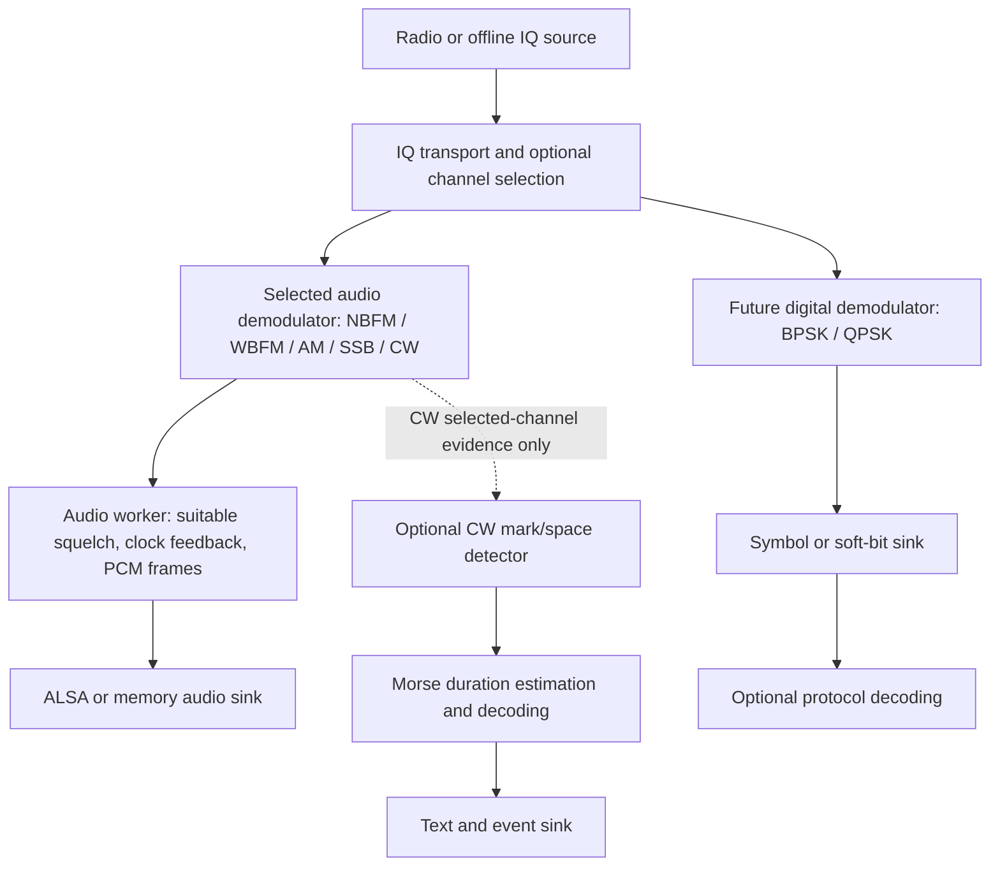

# Demodulator architecture and reuse

Date: 2026-09-20. Status: design recommendation, not an implemented refactor.
Code reviewed at `44fee8a`, including the mono WBFM implementation originally
introduced in `e1ebd4c`.

## Recommendation

Use separate `nbfm_demod.c/.h` and `wbfm_demod.c/.h` implementations, composed
from small DSP modules with names that describe their operation. Share the
streaming contract and audio infrastructure. Avoid making `demod_helpers.c`
a collection of unrelated algorithms.

A common `fm_demod` factory or facade is reasonable for selecting NBFM/WBFM,
but it should not force their internal processing into one algorithm selected
only by bandwidth/deviation parameters. For future AM, SSB and CW listening, prefer an
`audio_demod` interface at the worker boundary. BPSK/QPSK should have a separate
symbol/data output contract, sharing lower-level DSP where appropriate.
CW adds a useful combined case: audio for listening plus an optional Morse
text/event output. Keep its decoder separate from the audio demodulator so
listening does not depend on successful automatic decoding.

This combines the useful parts of both proposals: common configuration and
lifecycle at the application boundary, explicit mode-specific signal chains
inside. It does not require a runtime flowgraph, a plugin system, or a new DSP
library dependency.

## Why this fits the current code

The following observations come from
[nbfm_demod.c](../software/libcariboulite/src/nbfm_demod.c) and
[its header](../software/libcariboulite/src/nbfm_demod.h), rather than a textbook
model of how FM could be implemented.

| Property | Existing NBFM | Existing mono WBFM |
| --- | --- | --- |
| Input | IQ16, 2 or 4 MS/s | Same |
| IQ rate reduction | Boxcar averages: input → 200 kS/s → 50 kS/s | Symmetric FIR: input → 250 kS/s |
| Discriminator | Unit-vector limiter, conjugate product, small-angle phase approximation | Conjugate product and `atan2f`; no explicit unit-vector limiter |
| Nominal deviation used for gain | ±2.5 kHz | ±75 kHz |
| Post-discriminator reduction | Already at 50 kS/s | 401-tap FIR and decimation by 5 to 50 kS/s |
| Audio resampling | Legacy linear interpolation to 48 kHz | 32-tap fractional-delay bank with 256 phase intervals to 48 kHz |
| Common audio operations | DC removal, configurable de-emphasis, gain and S16 clipping | Same |
| Additional audio filtering | One-pole low-pass around 3.2 kHz | Mono filtering before audio resampling; bypasses the NBFM output low-pass |
| Reset | Preserves boxcar accumulation state for compatibility | Clears all WBFM signal history |
| Noise squelch | Uses a discriminator tap and NBFM-specific thresholds | Disabled; carrier squelch remains available |
| API naming | `nbfm_demod_*` | `wbfm_demod_create`, then `nbfm_demod_*` for all other operations |

The common API already has valuable guarantees: explicit consumed/produced
counts, caller-owned buffers, bounded output capacity, allocation-free
processing and single-owner state. Keep these guarantees.

The shared owner currently contains both NBFM fields and an optional WBFM
state. Mode branches occur in processing and reset. Renaming the files alone
would improve discoverability, but would not remove those structural differences.
The legacy phase approximation and interpolation should not silently become the
universal FM algorithm during a naming cleanup.

[demod_worker.c](../software/libcariboulite/src/demod_worker.c) owns frame packing,
audio FIFO feedback, squelch and worker scheduling.
[rx_pipeline.c](../software/libcariboulite/src/rx_pipeline.c) owns DSP construction,
queues, radio and audio lifecycle. These are good boundaries to retain.
The transport currently fixes audio frames at 480 mono S16 samples in
[pipeline_transport.h](../software/libcariboulite/src/pipeline_transport.h).

The user reported almost 12 hours of continuous WBFM reception and audio output
on 2026-09-20 after switching the external ALSA bridges to raw PCM. This is useful
operational evidence, not a captured RF-quality measurement or proof of all
rates, stations and reset cases. Preserve the working implementation as a
regression reference before extracting it.

## Comparing the approaches

| Approach | Benefit | Cost or risk | Assessment |
| --- | --- | --- | --- |
| Rename to `fm_demod` and keep the present internals | Small change; honest FM-family name | Mixed state and mode branches remain | Reasonable interim cleanup |
| One parameterized FM engine | Can share one validated algorithm with NB/WB presets | Current modes differ in algorithms, stage order and reset behavior; unifying changes numerics and CPU cost | Possible later DSP redesign, not the first refactor |
| Separate modes plus `fm_demod_helpers` | Clear implementation ownership; modest extraction | FM helpers are the wrong home for AGC, resampling or PSK synchronization | Good starting direction if helpers stay specifically FM |
| Separate modes plus named DSP modules | Reuse across analog and digital modes; independently testable state | Requires clear rate, scaling and ownership contracts | Recommended direction |
| One universal demodulator with all mode parameters | One application entry point | Invalid combinations, mixed audio/data outputs and extensive branching | Avoid as an internal DSP architecture |

Parameterized algorithms are still useful **inside** the recommended design:
a FIR accepts coefficients, a discriminator accepts a normalization factor,
and a resampler accepts a rate ratio. The mode owns the choice and ordering
of those algorithms and validates a supported configuration.

## Component-to-mode matrix

Scope: mono NBFM and broadcast WBFM; conventional full-carrier double-sideband
AM for aviation listening; USB/LSB voice; keyed-carrier CW with optional Morse
decoding; ordinary coherent BPSK/QPSK reception
with unknown transmitter phase and symbol timing. Differential and offset PSK
variants need their own profiles. The matrix describes a proposed receiver,
not features that all exist in this repository.

**R** = required function in this scope; **O** = optional or signal/profile
 dependent; **—** = not part of the normal path. A required function can be
combined with another stage; it does not imply a separate C file or buffer.
In the CW column, **D** means required only when the optional Morse decoder is
enabled. CW means keyed RF carrier reception, not an audio tone carried over FM
or AM; those tones would first pass through their respective audio demodulators.

### IQ conditioning and detection

| Component/function | NBFM | WBFM mono | AM voice | SSB USB/LSB | BPSK | QPSK | CW + optional Morse |
| --- | --- | --- | --- | --- | --- | --- | --- |
| IQ input conversion and documented scale | R | R | R | R | R | R | R |
| Channel selection and anti-alias filtering | R | R | R | R | R | R | R: narrow selectable channel |
| Decimation to a suitable processing rate | R | R | R | R | R | R | R |
| Digital frequency shift / NCO | O | O | O | R: local carrier/BFO function | R: carrier correction | R: carrier correction | R: audible beat note |
| IQ DC-offset / imbalance correction | O | O | O | O | O | O | O: preserve wanted carrier |
| AGC or level normalization | O | O | O: slow enough to preserve envelope | O: useful for listening | O: often useful for loop/decision scaling | O: often useful for loop/decision scaling | O: preserve keying and gaps |
| Explicit constant-envelope limiter | O | O | —: destroys wanted envelope | —: distorts signal | —: not a default stage | —: not a default stage | —: retain keying evidence |
| FM phase-difference discriminator | R | R | — | — | — | — | — |
| Envelope detector | — | — | R: chosen baseline | — | — | — | D: channel magnitude/power |
| Sideband selection and product detection | — | — | O: synchronous alternative | R | — | — | R: product detection; selectable beat sign |
| Carrier phase/frequency recovery | O: AFC only | O: AFC only | O: synchronous alternative | O: precise tuning can suffice for voice | R | R | O: frequency tracking, no phase lock required |
| Pulse-matched filtering | — | — | — | — | R: matched to pulse profile | R: matched to pulse profile | O: keying-envelope model |
| Symbol timing recovery | — | — | — | — | R | R | D: Morse duration estimation, not PSK clock recovery |
| Equalization | — | — | — | — | O | O | — |

Decimation is required here because the current hardware path delivers 2/4 MS/s;
it is not intrinsic to every possible receiver. A hardware tuning operation may
provide a mixer function, and a correctly tuned SSB implementation need not run
an additional nonzero digital oscillator. Avoid double-counting these functions.

FM detects the phase increment of successive complex samples; normalization
relates radians/sample to the chosen deviation. This is the shared mathematical
operation, not a reason to share all filtering or approximation choices.
See [GNU Radio quadrature demodulator documentation](https://www.gnuradio.org/doc/doxygen/classgr_1_1analog_1_1quadrature__demod__cf.html).

For envelope AM, channel filtering must precede the nonlinear magnitude
operation, followed by carrier/DC removal and audio filtering. GNU Radio's
[AM implementation](https://github.com/gnuradio/gnuradio/blob/main/gr-analog/python/analog/am_demod.py)
provides a concrete magnitude-to-audio example. An FM limiter cannot be reused
there because it removes the amplitude variation we want to recover.

SSB requires preserving the wanted sideband and restoring its audio frequency
placement. With complex IQ, a complex sideband-selecting filter and frequency
translation can do this; a separate Hilbert transform is not universally needed.
[Liquid-DSP's AM/SSB documentation](https://www.liquidsdr.org/doc/ampmodem/)
illustrates the distinction between full-carrier, suppressed-carrier and
sideband modes. The BFO-based voice receiver described here is a design choice,
not a requirement to adopt that library's specific tracking implementation.

### Audio, symbols and output handling

| Component/function | NBFM | WBFM mono | AM voice | SSB USB/LSB | BPSK | QPSK | CW + optional Morse |
| --- | --- | --- | --- | --- | --- | --- | --- |
| Audio DC/carrier-bias removal | R | R | R | O | — | — | O: after beat-note translation |
| Audio-band filtering | R | R | R | R | — | — | R: around listening pitch |
| FM de-emphasis | O: transmission profile | R: broadcast profile | — | — | — | — | — |
| Pilot/stereo multiplex rejection | — | R | — | — | — | — | — |
| Audio resampling / sound-device clock matching | R | R | R | R | — | — | R: listening branch only |
| PCM gain, clipping, audio frame packing | R | R | R | R | — | — | R: listening branch only |
| Audio squelch with click-suppression ramp | O | O | O | O | — | — | O: must preserve short elements |
| RSSI / signal-power measurement | O | O | O | O | O | O | D: selected-channel evidence |
| NBFM discriminator-noise squelch | O | — | — | — | — | — | — |
| Symbol decisions and constellation mapping | — | — | — | — | R: 1 bit/symbol | R: 2 bits/symbol | —: use mark/space classification |
| Carrier ambiguity resolution | — | — | — | — | R: 180° | R: 90° rotations | —: envelope is phase-insensitive |
| Soft-bit likelihoods | — | — | — | — | O | O | —: use detection confidence |
| Frame synchronization, descrambling, FEC, CRC | — | — | — | — | O: protocol layer | O: protocol layer | —: Morse parsing is separate |
| Data sink and synchronization diagnostics | — | — | — | — | R | R | D: text/events and timing status |

The audio requirements assume live listening through the existing sound-device
path. A file-only receiver would not need its clock-feedback controller. Digital
receivers instead align sampling to transmitted symbols:
[Liquid-DSP symbol synchronization](https://www.liquidsdr.org/doc/symsync/)
shows matched filtering integrated with timing estimation and resampling.
A Costas loop is one carrier-recovery choice, with different phase detectors for
BPSK and QPSK; see the
[GNU Radio Costas-loop interface](https://github.com/gnuradio/gnuradio/blob/main/gr-digital/include/gnuradio/digital/costas_loop_cc.h).

The ordering of digital synchronization blocks depends on their algorithms and
acquisition range. Do not freeze one chain order into generic helpers. Framing,
bit mapping, differential coding and FEC are not determined by “BPSK” or “QPSK”
alone; they need an identified signal/protocol before implementation.

### CW listening and optional Morse decoding

CW should be a first-class receive mode, implemented initially as a narrow
complex channel filter followed by frequency translation/product detection to
an audible beat note. Reuse the FIR, NCO, resampler and audio-output blocks
needed by SSB. Keep channel bandwidth and listening pitch independent; proposed
starting controls are a 600 Hz pitch and selectable 250/500 Hz channel widths,
subject to tests rather than fixed requirements. Filter width must accommodate
keying speed and drift: excessive narrowing causes ringing and smears edges.
A carrier translated exactly to DC will not produce the desired listening tone.

The optional decoder should consume selected-channel magnitude/power **before**
listening gain, squelch, PCM clipping and sound-device clock correction. Branch
from filtered IQ before the listening BFO; its magnitude does not need that
frequency shift. This avoids making recognition depend on speaker volume or
pitch. An audio-tone detector could be a later input adapter for recordings or
Morse carried by another mode; do not route native CW through ALSA to decode it.
These are proposed implementation choices, not existing capabilities.

| Decoder stage | Responsibility and proposed boundary |
| --- | --- |
| Channel evidence | Estimate magnitude/power and a local noise baseline; optionally track slow frequency drift without chasing a neighbouring carrier |
| Mark/space detection | Adaptive threshold, hysteresis and bounded glitch rejection; retain confidence and sample-based transition times |
| Duration estimation | Track dot duration and sending-speed changes; distinguish marks from the different gap classes |
| Morse parsing | Classify dot/dash sequences and character/word gaps; map supported characters and procedural signs |
| Output | Emit bounded text/events, timing estimate and uncertain/unknown indications to a UI or data sink independently of audio |

Nominal timing uses one unit for a dot, three for a dash, and gaps of one,
three and seven units within a character, between characters and between words.
The character definitions and these timing ratios come from
[ITU-R M.1677-1, Annex 1](https://www.itu.int/dms_pubrec/itu-r/rec/m/R-REC-M.1677-1-200910-I!!PDF-E.pdf).
Treat them as the baseline, not exact equality tests for hand-sent code. Allow
independent character/word gap estimates for stretched spacing; ARRL also lists
[Farnsworth timing guidance](https://www.arrl.org/cw-mode).

Morse timing is not a fixed-rate BPSK/QPSK symbol clock: its variable mark/gap
durations convey information. Reuse general filtering and estimation primitives,
but give `morse_decoder` its own timing state machine. Do not require a Costas
loop or phase coherence across key-up intervals. Optional frequency tracking
should hold or relax appropriately when the signal disappears.

The existing RSSI carrier squelch is not a Morse key detector. Its measurement
bandwidth and response time are different from the selected CW channel. Likewise,
NBFM noise squelch and its audio gate must not silently become CW defaults. Fast
AGC can amplify key-up noise, while long squelch qualification or excessive
smoothing can erase short dots. Keep these controls out of decoder evidence and
verify their effect on listening separately.

Audio should continue when the decoder loses confidence, its output queue fills,
or it is disabled. Bound the event queue, report overflow, and discard/reset
incomplete decoder state explicitly rather than blocking the receive worker or
inventing text. Missing IQ is an **unknown interval**, not a measured Morse space:
reset the affected character and reacquire timing after a discontinuity. Ordinary
key-up silence, in contrast, is required input for completing characters and
words. Define an explicit end-of-stream policy for trailing marks/gaps.

### Aviation AM profile

Prefer `am_demod` with a named aviation voice profile over `nbam_demod` as the
underlying algorithm name. “Narrow” specifies filtering, not a different envelope
 detector. Keep RF channel width, audio passband and tuning/channel selection
as separate settings. In particular, 8.33 kHz channel spacing is not an audio
cutoff, and a displayed channel designation must not automatically be treated
as its carrier frequency. EUROCONTROL describes the 25/8.33 kHz channel naming
context in its [implementation support material](https://www.eurocontrol.int/function/833-khz-implementation-support).
Exact profile coefficients and channel-name mapping remain future work.

## Proposed boundaries and file ownership

These are target responsibilities, not a request to create every file now.
Extract only components with an actual consumer and a tested contract.

| Module | Responsibility | When to introduce |
| --- | --- | --- |
| `nbfm_demod.c/.h` | NBFM chain, configuration, state and compatibility behavior | First refactor |
| `wbfm_demod.c/.h` | WBFM chain and independent state, same audio-facing contract | First refactor |
| `audio_demod.c/.h` | Opaque audio-demodulator handle, mode factory, bounded processing dispatch | First refactor or before adding AM |
| `fm_discriminator.c/.h` | Phase-difference detection, previous-IQ state, normalization | When extraction preserves both strategies; retain explicit legacy NBFM policy |
| `fm_deemphasis.c/.h` | Parameterized sample-rate/time-constant filter | Natural first shared FM block |
| `dsp_fir.c/.h` | FIR coefficient generation and appropriate real/complex filtering kernels | Extract WBFM routines with their actual supported constraints |
| `dsp_resampler.c/.h` | Fractional resampling state, ratio, filtering and bounded output | Start with existing WBFM kernel; do not claim arbitrary ratios yet |
| `audio_postprocess.c/.h` | Audio DC filter, optional audio filter, gain and S16 conversion | Extract common audio behavior without changing operation order |
| `dsp_nco`, `dsp_agc`, `symbol_sync`, `carrier_sync` | Oscillation, level control and independent synchronization state | NCO/AGC with SSB/CW consumers; symbol/carrier loops with PSK, not speculative stubs |
| `am_demod`, `ssb_demod` | Compose IQ-to-audio paths using shared primitives | When those modes are implemented |
| `cw_demod.c/.h` | Narrow channel selection and beat-note audio; optional channel-evidence output | Near-term CW listening mode |
| `cw_detector.c/.h` | Selected-channel evidence to timestamped mark/space transitions and confidence | With optional Morse decoding |
| `morse_decoder.c/.h` | Transition durations to character/word/procedural-sign events; no radio or audio-device dependencies | After the CW detector; test separately with generated keying events |
| `psk_demod` or separate `bpsk_demod` / `qpsk_demod` | IQ-to-symbol/soft-bit paths with explicit signal profiles | After choosing the first digital waveform |
| Workers and pipelines | Hardware transport, queue policies, lifecycle and application outputs | Retain outside all standalone DSP modules |

A BPSK/QPSK family engine may ultimately be more justified than a universal FM
engine: many synchronization and decision operations can use an explicit
constellation configuration. Decide that when implementing the first two digital
profiles. This is an architectural inference, not a measured benefit here.

Do not move the existing NBFM noise/carrier squelch modules into a general helper
file. Their separation already permits reuse of suitable measurements and gates.
AGC state also belongs to a dedicated operation, not the radio gain control API;
[Liquid-DSP's AGC documentation](https://liquidsdr.org/doc/agc/) is useful context
for level normalization and signal detection.

The branches are alternatives for the present single-selected-mode design, not
a proposal for simultaneous demodulation of different modes. CW alone can produce
listening audio and optional decoder events from the same selected channel; the
Morse branch taps evidence before audio postprocessing. Channel selection can initially remain
inside each demodulator so that its coefficients and rate plan remain explicit.

## Contracts that matter more than filenames

1. **Output type:** initially preserve IQ16 → mono S16 at 48 kHz for audio modes.
   Internal float stages are useful, but changing the public output type during
   extraction would expand the task. Digital processing must return symbols,
   bits or soft bits through separately typed buffers, never disguised as PCM.
   CW keeps audio output and an optional separately typed evidence/event stream;
   decoder enablement must not alter the listening samples or block audio.
2. **Progress:** preserve consumed/produced/error reporting, capacity bounds and
   no retained caller buffers. Document count units. Allow a valid output prefix
   with an error only if the interface defines it. Define pending output and
   end-of-stream filter-tail behavior before adding general resamplers.
3. **State and lifecycle:** allocate at creation, no allocation or device I/O in
   processing; one serialized owner. Join workers before freeing DSP state.
   Keep legacy NBFM reset semantics explicit; a future discontinuity/cold reset
   can be a separate operation rather than silently changing the existing one.
4. **Rate and scale:** every stage declares sample rate, real/complex type and
   amplitude meaning. Supported rate plans are validated presets. A 50→48 kHz
   kernel is not automatically a general interpolator producing multiple outputs
   per input; the present process loop assumes fewer than one output per 50 kHz
   input interval.
5. **Clock control:** the audio worker measures audio queue depth and passes a
   bounded correction to an audio resampler. PSK timing recovery estimates the
   transmitter's symbol timing from the signal. These may share interpolation
   math, but must not share control-loop state or feedback measurements.
   Morse durations use the evidence stream's sample index/rate, not worker wakeup
   times or the sound-device clock. Carry discontinuity information with it.
6. **Diagnostics and squelch:** use explicitly typed optional measurements or
   capabilities. The current `raw_audio` tap means different things for NBFM and
   WBFM; do not advertise it as a universal unfiltered discriminator stream.
   A mode without a suitable noise metric must reject/disable that squelch type.
7. **Configuration:** a tagged mode-specific configuration avoids irrelevant
   options such as FM deviation on AM or audio de-emphasis on QPSK. Common fields
   can cover input format/rate; audio and digital settings belong in their own
   sections. Preserve stopped-only menu-14 switching, including loopback guards.
8. **Gaps and errors:** existing IQ frames carry RSSI but no explicit sample-gap
   marker. Future digital reception needs a documented response to missing IQ,
   lost lock and backpressure; dropping old frames may require reacquisition.
   Do not treat FIFO overflow as harmless for a symbol stream. Propagate worker
   errors to the pipeline in a separately scoped change. For Morse, report an
   unknown interval and clear an incomplete character instead of counting the
   missing samples as a valid inter-character or inter-word gap.

For a first implementation, dispatch once per block through an enum switch or
small operations table. Both are adequate. Avoid per-sample virtual dispatch,
and do not introduce dynamic loading. Keep existing `nbfm_demod_*` wrappers for
the offline demo/tests while updating the production worker to neutral names.

## Incremental plan and acceptance checks

| Step | Change | Evidence needed before moving on |
| --- | --- | --- |
| 1. Freeze behavior | Preserve current WBFM implementation as an extraction oracle alongside existing NBFM fixtures | Same generated IQ, rates, chunk boundaries, capacities, reset points, correction and controls |
| 2. Separate mode state and files | Independent NBFM/WBFM ownership; maintain public compatibility wrappers | Byte-identical PCM and consumed/produced sequences for a pure extraction; no allocation/lifetime regressions |
| 3. Extract common operations | Move only genuinely shared audio/FM/FIR primitives; retain algorithm policies | Same output; filter/scale/reset contracts tested; standalone build still has no radio/ALSA dependency |
| 4. Neutral worker interface | Audio-mode factory/dispatch and clear capability reporting | Mode switch refused while TX/RX/loopback active; preserved settings and NBFM-only noise-squelch behavior |
| 5. Add CW listening, AM and SSB | Prioritize near-term CW; reuse the NCO/filter/audio primitives as the other modes are added | CW pitch and keying-envelope fidelity, bandwidth and neighbouring-carrier rejection; AM modulation-depth/DC/gain; USB/LSB rejection and tuning; both hardware input rates |
| 6. Optional Morse decoding | Add selected-channel detection, duration estimation and separate text/event output | Known messages across supported speeds, spacing styles, noise, fading, drift and block sizes; loss/overflow handling; unchanged audio with decoding on/off |
| 7. First PSK receiver | Select symbol rate, pulse shape, mapping and protocol scope; introduce typed data output | Timing/carrier acquisition, phase ambiguity, BER versus noise, frequency/clock offset and gap recovery tests |

For CW, generate keyed IQ with known transition times and messages. Test detector
edge bias from filter delay/ringing separately from parser accuracy on ideal
mark/space events. Include changing speeds, unequal hand-keyed durations,
Farnsworth-style spacing, long silence, nearby carriers and noise-only input.
Measure character errors and false text, not just a successful clean example.
Retune/gap resets, trailing-character handling, event capacity and decoder
independence from listening pitch/gain/squelch need explicit checks.

Every DSP-affecting step should retain the existing synthetic WBFM checks for
full deviation, audio passband, multiplex and alias rejection, de-emphasis and
chunk-independent output. Relevant suites are
[test_nbfm_demod.py](../software/libcariboulite/tests/test_nbfm_demod.py),
[test_wbfm_demod.py](../software/libcariboulite/tests/test_wbfm_demod.py),
[test_rx_lifecycle.py](../software/libcariboulite/tests/test_rx_lifecycle.py),
[test_squelch.py](../software/libcariboulite/tests/test_squelch.py) and
[test_memory_audio.py](../software/libcariboulite/tests/test_memory_audio.py).

Build both `cariboulite_test_app` and `nbfm_memory_demo`; update direct compile
commands and Python test source lists when splitting translation units.
Measure CPU time, peak allocations and processing latency on the Pi at both RF
rates. Compare under the same compiler flags and system load. Repeat live
listening/endurance checks after structural changes; the overnight report is
baseline evidence rather than a substitute for regression tests.

If algorithm improvements are desired (better NBFM anti-alias filtering, a common
full-range discriminator, different gain calibration or unified resets), make
them separate changes with signal-quality acceptance criteria. They should not
be hidden inside the file refactor.

## Open decisions

- For near-term CW, what pitch/bandwidth range, speed range and character/prosign
  set should the first version support? Where should decoded text appear, and how
  should uncertain characters be displayed? Begin with a manually selected
  channel; automatic discovery of multiple CW stations is a separate feature.
- Which digital waveform should be supported first? BPSK/QPSK alone does not
  specify symbol rate, pulse shape, mapping, framing or output consumer.
- Should a future audio API expose float samples, with S16 conversion at the
  sink boundary? Defer until there is a consumer that benefits.
- Which AM audio/channel profiles and SSB tuning controls are wanted? Define
  passband, transition width, stopband rejection and tuning semantics explicitly.
- Would measured needs justify adopting a DSP library? The sources above are
  design references, not a dependency or code-copying recommendation.

Related repository notes: [modulator research](modulator-architecture-research.md),
[extension guide](audio-dsp-extension-guide.md),
[interface reference](audio-dsp-interfaces.md), and [RX squelch](rx-squelch.md).
External references were consulted on 2026-09-20; their block designs establish
useful distinctions, while the proposed module boundaries and migration plan
are recommendations for this repository.
