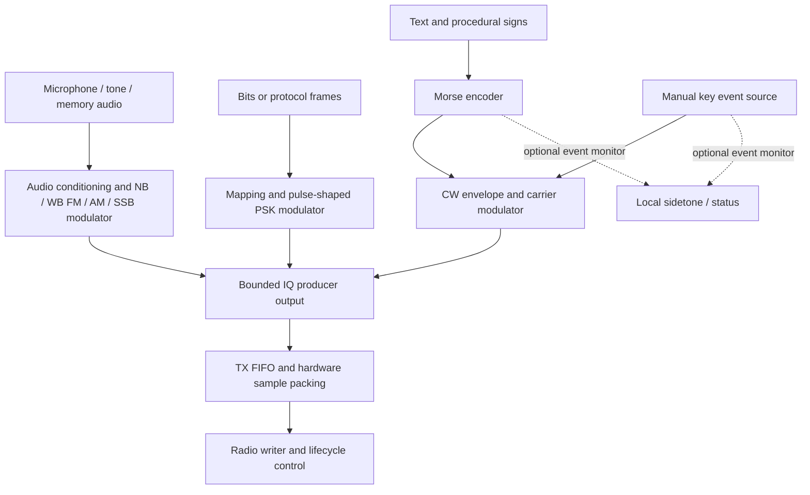

# Modulator architecture and reuse

Date: 2026-09-20. Status: design recommendation, not an implemented refactor.
Code reviewed at `44fee8a`. Companion to the
[demodulator architecture research](demodulator-architecture-research.md).

## Recommendation

Separate **source interpretation**, **waveform generation** and **radio transport**.
Audio modes consume audio samples; BPSK/QPSK consume symbols or bits from a
specified protocol; CW consumes timed keying events, optionally generated from
text. All produce IQ, so a common output/transport contract is useful without
forcing the inputs into one audio interface.

Use named DSP primitives shared with receivers where the mathematics and
contracts actually match: oscillators, FIR kernels, coefficient design, sample
conversion and appropriate resamplers. Give waveform families explicit state and
configuration. Avoid a growing `mod_helpers.c` or a universal modulator with every
mode's parameters.

There is one useful difference from the receiver recommendation: **a common
parameterized FM waveform core is a strong candidate for both NBFM and mono
WBFM TX**. Both integrate an instantaneous-frequency command into carrier phase.
Their audio bandwidth, pre-emphasis, peak-deviation control and rate plans belong
in distinct validated profiles. The current NB/WB receivers have more substantial
algorithm and reset differences, so the case for a single RX implementation is
weaker. This is a design inference from the present code, not a completed
performance comparison.

Start with compatibility-preserving extraction, then introduce new modes.
A shared FM core does not mean that raising the current deviation limit is a
complete WBFM transmitter. Do not couple RX-mode selection to TX-mode selection:
menu 14 currently selects NBFM/WBFM reception while TX remains NBFM.

## Current implementation and constraints

The standalone implementation is
[nbfm_mod.c](../software/libcariboulite/src/nbfm_mod.c), with its contract in
[nbfm_mod.h](../software/libcariboulite/src/nbfm_mod.h).

| Area | Current behavior | Consequence for extension |
| --- | --- | --- |
| Input | Normalized mono float, exactly 48 kHz | Good audio source contract; inappropriate as a symbol/key-event API |
| Output | IQ16 at exactly 2 or 4 MS/s | Preserve supported hardware rates initially |
| Configuration | Deviation 0–24 kHz; optional pre-emphasis; IQ scale 0–32767; hold/linear frequency interpolation | Cannot configure nominal ±75 kHz WBFM as-is |
| Defaults | 48 kHz → 4 MS/s, 2.5 kHz deviation, pre-emphasis off, scale 12000, linear interpolation | Standalone defaults differ from some application settings |
| Input queue | 4096 float samples, copied into owned storage | Bounded buffering; preserve short-consumption semantics |
| Signal generation | Clip audio to ±1, optional two-tap pre-emphasis, interpolate frequency, integrate phase, calculate sine/cosine, quantize | No explicit audio band-limiting FIR or post-pre-emphasis deviation limiter |
| Peak deviation | `f_dev_hz` scales unit audio before pre-emphasis | Enabled pre-emphasis can increase the frequency command beyond that nominal value |
| Underrun | Continue IQ generation, hold last frequency, report `held_audio` | Compatibility behavior, not a universal idle policy |
| Zero-capacity calls | May enqueue audio without producing IQ | Different from the current demodulator's zero-capacity contract |
| Reset | Discard audio queue; reset oscillator, interpolation and pre-emphasis state | Preserve for compatibility; resetting a live carrier would introduce a phase discontinuity |
| Allocation | At creation only; no retained caller buffer pointers | Retain for all future waveform engines |

[mod_worker.c](../software/libcariboulite/src/mod_worker.c) consumes 480 audio
samples per iteration and produces one 10 ms RF frame. It chooses microphone,
tone or injected audio and treats short processing or reported held audio as a
TX error. It also inserts the hardware TX-enable marker in the I sample's low
bit; that operation belongs to transport packing, not a future generic modulator.

[tx_pipeline.c](../software/libcariboulite/src/tx_pipeline.c) constructs NBFM with
pre-emphasis disabled, owns hardware rate/power settings and threads, checks the
FPGA sample-gap configuration, and manages start/stop. Normal operation injects
2525 Hz and 2475 Hz audio tones at start and stop, with zero-audio padding and
bounded waiting. These are application behaviors, not requirements for every
waveform. Zero audio in FM still produces a carrier; it does not mean RF off.

The existing tone source generates **audio**. A 600 Hz tone into NBFM is an
FM-modulated carrier, not native keyed-carrier CW. Likewise, an existing hardware
continuous-carrier test is not a shaped Morse transmitter.

## Comparing the approaches

| Approach | Benefit | Cost or risk | Assessment |
| --- | --- | --- | --- |
| Rename `nbfm_mod` to `fm_mod` only | Clearer family name if WBFM is introduced | Does not add conditioning, supported deviation or spectral validation | Useful naming step, not feature completion |
| Parameterized FM core plus NB/WB profiles | Shares oscillator/integration code and testable rate/deviation scaling | Profile validation and conditioning still need real design | Recommended for the FM family |
| Fully separate NB/WB modulators | Explicit ownership and independent tuning | Risks duplicated oscillators and buffer logic | Use thin profile wrappers if useful; avoid unnecessary core duplication |
| Separate audio, PSK and CW engines with named primitives | Honest input types, shared IQ output, waveform-specific lifecycle | Requires explicit buffering and completion contracts | Recommended overall architecture |
| One all-mode modulator with generic audio input | One application call shape | Hides symbols/key timing in PCM; accumulates irrelevant parameters and policies | Avoid |

The receiver and transmitter can share an NCO implementation, but not oscillator
state. They can share a FIR kernel, but not automatically its coefficients or
rate schedule. FM pre-emphasis and de-emphasis need distinct transfer functions
and tests; they are not one filter with a sign changed.

## Component-to-mode matrix

Scope: NBFM voice, mono broadcast-style WBFM, conventional full-carrier AM voice,
USB/LSB voice, pulse-shaped BPSK/QPSK and keyed-carrier CW. Stereo multiplex,
RDS, offset/differential PSK variants and automatic multi-signal transmission
are outside the initial scope. AM includes a possible narrow voice profile;
receiver-side aviation channel naming does not itself define a TX implementation.

**R** = required function for the proposed implementation; **O** = optional or
profile-dependent; **—** = not normally part of this path. Required functions
may be combined into a single stage; the matrix does not prescribe file counts.

### Source and baseband preparation

| Component/function | NBFM | WBFM mono | AM voice | SSB USB/LSB | BPSK | QPSK | CW |
| --- | --- | --- | --- | --- | --- | --- | --- |
| Audio input and scale validation | R | R | R | R | — | — | O: local sidetone only |
| Audio bandwidth/DC conditioning | R | R | R | R | — | — | — |
| Microphone gain/compression | O | O | O | O | — | — | — |
| FM pre-emphasis | O: profile | R: broadcast-style profile | — | — | — | — | — |
| Peak-deviation control | R | R | — | — | — | — | — |
| AM depth/carrier-headroom control | — | — | R | — | — | — | — |
| Analytic audio / sideband generation | — | — | — | R | — | — | — |
| Explicit bit order and symbol mapping | — | — | — | — | R: 1 bit/symbol | R: 2 bits/symbol | — |
| Framing, scrambling, FEC, CRC | — | — | — | — | O: protocol | O: protocol | — |
| Differential encoding | — | — | — | — | O: protocol | O: protocol | — |
| Symbol-rate scheduler and pulse shaping | — | — | — | — | R | R | — |
| Timed key-event source | — | — | — | — | — | — | R |
| Text-to-Morse and spacing generation | — | — | — | — | — | — | O |
| Key-envelope rise/fall shaping | — | — | — | — | — | — | R |

### IQ generation, output and lifecycle

| Component/function | NBFM | WBFM mono | AM voice | SSB USB/LSB | BPSK | QPSK | CW |
| --- | --- | --- | --- | --- | --- | --- | --- |
| Frequency command → phase integration | R | R | — | — | — | — | — |
| Carrier term / amplitude modulation | — | — | R | — | — | — | R: keyed envelope |
| Complex waveform generation | R | R | R | R | R | R | R |
| Optional frequency-offset NCO | O | O | O | O | O | O | O |
| Rate conversion and image suppression | R | R | R | R | R | R | R: shape at a defined sample rate |
| Sample-based timing and phase continuity | R | R | R | R | R | R | R |
| IQ scaling, headroom and conversion | R | R | R | R | R | R | R |
| Explicit burst/start/stop envelope policy | R | R | R | R | R | R | R |
| RF queueing, hardware packing, partial writes | R | R | R | R | R | R | R |
| Audio-source clock matching | O: live audio | O: live audio | O: live audio | O: live audio | — | — | — |
| Receiver carrier/timing recovery loops | — | — | — | — | — | — | — |
| NBFM application start/stop tones | O: existing behavior | — by default | — by default | — by default | — | — | — |
| Explicit input starvation / EOF policy | R | R | R | R | R | R | R |

The NCO may be a zero-offset constant carrier; that does not require needless
per-sample trigonometry. Image suppression can be performed during interpolation,
and CW can shape its envelope directly at the final IQ rate. The table describes
functions, not a mandatory chain of separate conversions.

## Mode-specific waveform design

### NBFM and mono WBFM

A suitable shared mathematical core is:

```text
frequency_command[n] = deviation_hz * conditioned_audio[n]
phase[n+1] = wrap(phase[n] + 2*pi*frequency_command[n]/iq_rate)
iq[n] = amplitude * exp(j*phase[n])
```

The audio in this expression has already been interpolated to the core's rate.
[Liquid-DSP's FM documentation](https://www.liquidsdr.org/doc/freqmodem/)
provides the same phase-integration basis. Configuration must specify the core
rate and whether deviation normalization applies before or after conditioning.

For WBFM, design a profile for approximately 15 kHz mono audio, nominal ±75 kHz
peak deviation and selected 50/75 microsecond pre-emphasis. These are proposed
broadcast-style parameters, not measurements of a transmitter in this tree.
Audit the existing two-tap pre-emphasis response rather than treating its time
constant field as proof of a broadcast-quality response. Specify passband and
emphasis accuracy before replacing it.

Band-limit audio, apply the chosen emphasis and control resulting peaks. If a
nonlinear limiter is used, account for newly generated high-frequency content
and recheck peaks after subsequent filtering/interpolation. Linear interpolation
alone is not a general anti-image filter. A staged implementation may generate
FM at an intermediate rate and then interpolate complex IQ, but that rate must
preserve the **modulated signal's** bandwidth, not merely the audio bandwidth.

Preserve the current NBFM algorithm during extraction. Improved filtering,
pre-emphasis or deviation limiting should be separately measured changes.
Mono WBFM TX does not require a 19 kHz pilot, stereo subcarrier or RDS generator.

### Full-carrier AM and SSB

For AM, generate a carrier-scaled envelope proportional to `1 + mu * audio`,
where `mu` is modulation depth. For normalized input, a conventional envelope
receiver needs an envelope that does not cross zero. Reserve IQ peak headroom
for the carrier **plus** modulation: setting the unmodulated carrier to full
scale leaves no space for positive modulation peaks.

For SSB, form analytic audio using a Hilbert/filter method or an equivalent
complex-filter design, then select USB/LSB with an explicit frequency convention.
Match path delays in a phasing implementation. Carrier suppression, opposite
sideband rejection and peak amplitude are separate acceptance criteria.
See [Liquid-DSP's AM/SSB model](https://www.liquidsdr.org/doc/ampmodem/) for the
carrier and analytic-signal distinction. Do not put an FM constant-envelope
limiter after either AM or SSB synthesis.

### BPSK and QPSK

Separate bit-to-symbol mapping from pulse shaping. Specify bit packing, mapping,
phase convention, symbol rate, pulse shape, roll-off and filter span. A mapper
alone produces constellation points, not a complete band-limited transmitter;
[Liquid-DSP's modem API](https://www.liquidsdr.org/doc/modem/) explicitly separates
those functions. GNU Radio's
[generic digital modulator](https://github.com/gnuradio/gnuradio/blob/main/gr-digital/python/digital/generic_mod_demod.py)
is a useful example of composing mapping, optional differential coding and
interpolation.

A root-raised-cosine TX filter is a common choice when the receiver uses the
matching filter; [Liquid-DSP's FIR design documentation](https://www.liquidsdr.org/doc/firdes/)
describes these pulse families. Filtered PSK IQ is generally not constant-envelope
between symbol instants. Reserve peak headroom and avoid clipping the pulse shape.
A transmitter schedules symbols from its output clock; it does not need the
receiver's Costas loop or timing-recovery loop.

Preambles, payload framing, FEC and idle symbols belong to a specified protocol.
Do not invent a default idle bit stream for all PSK modes. A burst needs filter
startup/tail handling and enough acquisition structure for its intended receiver.

### CW and optional text-to-Morse

Use `cw_mod` to shape key events into a keyed RF carrier. Keep `morse_encoder`
separate: it maps text/procedural signs into timed marks and spaces. A manual
key source can bypass text encoding; a paddle source would additionally need
keyer logic, such as an explicitly selected iambic policy.

Nominal Morse timing uses dot/dash durations of one/three units, with one-unit
intra-character, three-unit character and seven-unit word gaps, as specified by
[ITU-R M.1677-1](https://www.itu.int/dms_pubrec/itu-r/rec/m/R-REC-M.1677-1-200910-I!!PDF-E.pdf).
Use a fractional sample-time accumulator so noninteger duration conversions do
not accumulate rounding drift. Keep element speed and expanded character/word
spacing separate if Farnsworth-style sending is supported. Character tables can
be shared with a decoder; encoding and decoding timing state machines cannot.

Generate a smooth attack/release envelope to limit key-click energy, for example
an explicitly configured raised-cosine ramp. Specify what happens when an event
is shorter than the selected ramps: constrain or adapt them without silently
changing message timing. Test the resulting occupied spectrum and mark/gap
boundaries. Keep the carrier oscillator continuous across blocks and preferably
across key-up intervals; amplitude keying belongs in the waveform, not in an
OS-timed loop that repeatedly switches the radio on and off.

The radio can remain enabled during a message's spaces while IQ amplitude is
zero. Actual carrier leakage is a hardware measurement, not guaranteed absent
by zero IQ. Keep PTT lead/tail timing distinct from Morse elements and measured
transport latency. A local sidetone is a separate audio sink driven from the
same event timeline; its chosen pitch must not shift the RF carrier frequency.
Define whether sidetone follows enqueue time or estimated transmit time.

## Input starvation, completion and clocks

| Mode family | Missing input | Normal end of input |
| --- | --- | --- |
| Current NBFM | Standalone core holds last frequency; production worker reports this as error | No general finite-stream drain API today |
| Future audio TX | Explicit source error/temporary-starvation status; profile may inject zero audio or request stop | Finish declared audio/filter tails, then apply burst/stop policy |
| PSK | Do not duplicate the last symbol or fabricate payload; protocol chooses idle, pause-before-burst or abort | Flush pulse-shaping tail, complete burst and report completion |
| CW | A scheduled space is valid data; missing future events is a different state | Finish the last release ramp, report message completion, then follow PTT-tail policy |

Distinguish source EOF, queued input empty, waveform tail complete, software FIFO
empty and samples actually transmitted. The current queue drain cannot establish
that every downstream device buffer has finished. Define the observable completion
level rather than claiming exact on-air timing from a producer acknowledgement.

Live microphone and radio sample clocks can differ. Future audio TX may need
bounded source-rate adaptation at the audio input; it must not alter nominal RF
sample rate or corrupt data/key timing. This is not the RX audio FIFO servo
reused unchanged. Symbols and Morse events should be scheduled on the IQ sample
timeline. If a separate event clock exists, define its mapping explicitly.

A future common IQ producer should distinguish output ready, need input, draining,
done and error, with explicit input units and counts. Preserve the current NBFM
queue/hold contract behind compatibility wrappers. Capacity-zero behavior, partial
consumption, no-progress calls and filter-tail generation must all be specified.
No allocations, blocking device operations or retained caller buffer pointers
belong in standalone processing.

## Proposed modules and shared ownership

These are target responsibilities. Introduce modules only with actual consumers.

| Module | Responsibility | Reuse boundary |
| --- | --- | --- |
| `nbfm_mod.c/.h` | Existing API/behavior or a thin NBFM profile wrapper | Keep offline examples and numerical compatibility |
| `fm_mod.c/.h` | Validated frequency-command phase integration and IQ generation | Share between NB/WB TX; oscillator primitive can also serve RX |
| `wbfm_mod.c/.h` | Mono WBFM conditioning/profile, optionally a thin facade | Same FM core, independent profile validation |
| `fm_preemphasis.c/.h` | Defined TX response and state | Related to but distinct from RX de-emphasis |
| `audio_tx_condition.c/.h` | Audio filtering, gain and mode-specific peak control composition | Avoid forcing the same limiter on AM, SSB and FM |
| `am_mod`, `ssb_mod` | Carrier/envelope or analytic sideband synthesis | Share FIR/NCO infrastructure with receivers |
| `psk_mapper`, `psk_mod` | Constellation mapping, pulse shaping and symbol scheduling | BPSK/QPSK can share a configured family implementation |
| `morse_encoder` | Text/prosigns to duration events | Shared alphabet with decoder; separate timing behavior |
| `cw_mod` | Key-envelope shaping and carrier generation | Manual or encoded event source, optional independent sidetone |
| `dsp_fir`, `dsp_resampler`, `dsp_nco` | Named, rate-aware DSP primitives | Independent instances and coefficients for TX/RX |
| `iq_convert` | Scale and quantize IQ with explicit peak behavior | Hardware TX-enable bits remain outside this conversion |
| TX source adapters / producer dispatch | Typed audio, symbol or key-event input to IQ blocks | Do not coerce all inputs into `audio_source_t` |
| TX transport and pipeline | Hardware packing, partial writes, queues, power/rate/PTT and lifecycle | Mode-independent transport with explicit mode policies |

The WBFM receiver's current 50→48 kHz real resampler is not immediately a TX
interpolator. TX needs multiple outputs per input, often complex processing and
much larger rate ratios. Share proven kernels while introducing a new scheduling
contract where necessary. Symmetric real FIR kernels likewise do not cover every
complex analytic-signal filter unchanged.



These are alternative selected waveform paths, not simultaneous transmissions.
PTT/start/stop belongs to the pipeline. Existing NBFM start/stop tones stay an
explicit NBFM application policy. Graceful completion and immediate abort must
be separate operations; new modes must not inherit tone injection on every stop.
Keep mode and structural-rate changes stopped-only, respecting RX and interface
loopback ownership as well as TX state.

## Incremental plan and validation

| Step | Work | Acceptance evidence |
| --- | --- | --- |
| 1. Freeze NBFM behavior | Capture existing configuration, queue, reset and hold semantics | Existing frozen-reference sample comparisons and partial-progress tests |
| 2. Extract common FM/audio primitives | Keep public wrappers and legacy operation order | Same IQ at both rates, reset/chunk equivalence, unchanged queue behavior and no processing allocations |
| 3. Separate source types and lifecycle policies | Audio producer remains supported; add explicit IQ producer completion/status | Partial writes, bounded stop/abort, failure cleanup and mode guards; no automatic NBFM tones for other modes |
| 4. Add near-term CW generation | Timed events, shaped envelope, optional Morse encoder | Timing, frequency, ramps, key-click spectrum, text mapping and partial-block cases |
| 5. Add mono WBFM profile | Validated conditioning, wider deviation and rate plan | Peak deviation after emphasis, audio response, occupied spectrum, image rejection and Pi CPU margin |
| 6. Add AM and SSB profiles | Envelope/headroom or analytic audio synthesis | AM depth and peaks; SSB sideband sign/rejection, carrier leakage and two-tone behavior |
| 7. Add first PSK waveform | Explicit mapping, pulse shape, symbol rate and protocol scope | Known symbol vectors, matched-filter EVM, bit recovery, spectrum and burst-tail handling |

Existing checks include
[test_nbfm_mod.py](../software/libcariboulite/tests/test_nbfm_mod.py),
[test_nbfm_rate.py](../software/libcariboulite/tests/test_nbfm_rate.py),
[test_memory_audio.py](../software/libcariboulite/tests/test_memory_audio.py),
[test_rx_lifecycle.py](../software/libcariboulite/tests/test_rx_lifecycle.py)
(which also exercises TX lifecycle),
[test_tx_stop_deadline.py](../software/libcariboulite/tests/test_tx_stop_deadline.py)
and [test_tx_write_progress.py](../software/libcariboulite/tests/test_tx_write_progress.py).
Build the application and standalone memory demo after translation-unit changes;
update the direct build examples and Python test source lists too.

Use independent measurements in addition to modulator→demodulator round trips:
matching mistakes can cancel. Check FM phase increments and spectral content,
AM envelope depth, SSB spectra, PSK reference symbols/EVM and CW event timing.
Test both 2 and 4 MS/s, varying input/output block sizes, zero capacity, starvation,
EOF, cancellation and repeated reset. Long CW messages should preserve fractional
timing without drift; decoder success alone is not a timing measurement.

For TX, occupied bandwidth, filter images, clipping and start/stop transients
are as important as recovered audio. Sample-domain tests cannot certify analog
RF power, carrier leakage or hardware distortion. IQ scale and configured RF
power are separate quantities. Hardware validation should measure those outputs
with an appropriate test setup; the successful overnight WBFM **receive** run
provides no transmit-quality evidence.

## Open decisions

- Is mono WBFM transmission wanted soon, or only CW and additional receive modes?
  The matrix includes WBFM TX for architecture planning, not as an implemented feature.
- For CW, which event sources, speed range, character/prosign set, ramp durations,
  sidetone behavior and PTT timing are needed first?
- Should the first common FM core retain legacy interpolation as a selectable
  compatibility policy, or should the old NBFM path remain isolated until a
  separately validated algorithm upgrade?
- Which AM/SSB audio profiles, target peak levels and spectral rejection limits
  should be supported? Define measurement criteria before choosing coefficients.
- Which BPSK/QPSK protocol fixes symbol mapping, pulse shape, rate and idle/burst
  behavior? Modulation names alone do not answer these questions.
- What completion status can the present driver/hardware actually expose, and
  how much transmit latency is acceptable for live keying?

Related notes: [demodulator research](demodulator-architecture-research.md),
[extension guide](audio-dsp-extension-guide.md) and
[interface reference](audio-dsp-interfaces.md). External primary references were
consulted on 2026-09-20; module boundaries and migration steps are recommendations
for this repository. No new library dependency or implementation is introduced.
