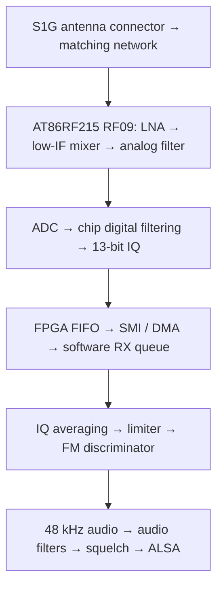

# Menu 14 NBFM RX chain and sensitivity investigation

Recorded 2026-10-10 from source inspection at revision
`60c6138` (`Fix TX-to-RX stream handoff`).

The user is investigating weak-signal reception in the **menu 14 NBFM receiver
at 430.125 MHz**. The transmitter's actual FM deviation has not been confirmed;
the current receiver normalizes discriminator output for **±2.5 kHz deviation**.

The clearest software improvement candidate is **better channel filtering before
FM demodulation**. The existing averaging stages admit considerably more noise
and adjacent-channel energy than a typical NBFM signal needs. The findings below
come from source/schematic inspection and filter calculations. Sensitivity gains
have not been measured, and this note records investigation context rather than
an implemented change.

## RX chain

| Stage | Current behavior |
| --- | --- |
| RF frontend | Direct RF09/S1G path. Menu 14 selects **2 MHz analog bandwidth**. The board's wideband amplifier and mixer belong to the other receive path. |
| Chip filtering and rate | IQ runs at **1, 2 or 4 MS/s**, initially 4 MS/s. The chip digital filter cutoff is configured to **half the sample rate**, much wider than NBFM. |
| Transport | FPGA buffers and transfers samples without RX filtering. Software stores signed 13-bit values in 16-bit containers and assembles **10 ms IQ blocks**. |
| Software IQ filtering | Two rectangular averages reduce IQ to **200 kS/s, then 50 kS/s**. There is no sharp NBFM channel filter. |
| FM detector | Normalizes IQ amplitude, calculates successive-sample phase differences, and uses an approximate angle function. Audio normalization assumes **±2.5 kHz deviation**. |
| Audio | Linear resampling to **48 kHz**, approximately **5 Hz DC rejection**, **50 µs de-emphasis**, a **first-order 3.2 kHz low-pass**, then PCM gain and clipping. Menu 14 defaults to PCM gain 8000. |
| Squelch | Noise squelch defaults **ON**; carrier squelch defaults **OFF**. Enabled detectors must both permit audio. |

The relevant source files are
[menu configuration](../software/libcariboulite/src/app_menu.c),
[radio bandwidth and rate configuration](../software/libcariboulite/src/cariboulite_radio.c),
[RX reader and pipeline](../software/libcariboulite/src/rx_pipeline.c),
[FPGA receive decoding](../firmware/lvds_rx.v),
[NBFM DSP](../software/libcariboulite/src/nbfm_demod_dsp.c), and
[audio processing](../software/libcariboulite/src/fm_audio.h).

## Improvement candidates

### 1. Replace the averaging decimators with proper channel filtering

The two averages are mathematically equivalent to one rectangular average of
`RF_rate / 50000` consecutive input samples. Calculating its response gives a
−3 dB point around **±22 kHz**, with a first zero at 50 kHz. At offsets of
**12.5 and 25 kHz**, attenuation is only approximately **0.9 and 3.9 dB**,
respectively, excluding chip filtering.

Noise and neighbouring signals therefore reach the nonlinear FM detector. Audio
filtering after demodulation cannot undo their effect on that detector.

For **±2.5 kHz deviation** and approximately **3 kHz voice bandwidth**, a complex
channel-filter passband around **±5.5–6 kHz** is a reasonable starting point,
with allowance for tuning error. Confirm the actual modulation before selecting
the filter. Use staged FIR filtering with adequate rejection before each
decimation; adding a narrow filter only after the existing decimation cannot
remove interference that has already aliased into the wanted channel.

This is a proposed experiment, not a measured sensitivity improvement. See the
[current NBFM DSP](../software/libcariboulite/src/nbfm_demod_dsp.c) and GNU Radio's
[channel-filter description](https://wiki.gnuradio.org/index.php/Frequency_Xlating_FIR_Filter).

### 2. Correct the discriminator's angle calculation

`fast_atan2f_small` behaves incorrectly for large phase changes: a true angle of
**2 radians returns approximately 4.50 radians**. Weak signals and noise can
produce these large changes. Comparing against full `atan2f` would establish its
effect on noise, distortion and CPU load.

The implementation is in
[nbfm_demod_dsp.c](../software/libcariboulite/src/nbfm_demod_dsp.c). Correctness of
the large-angle calculation is a source finding; its effect on measured receiver
sensitivity remains to be established.

### 3. Test narrower chip bandwidth and controlled gain settings

The AT86RF215 supports analog bandwidth down to **160 kHz**, which could reduce
exposure to blockers and broadband noise. Narrowing hardware bandwidth still
leaves software channel filtering necessary.

Menu 14 does not explicitly configure AGC. Fresh initialization inherits chip
defaults: AGC enabled, filtered measurement input, 8-sample averaging and a
−30 dBFS target. Earlier gain changes can persist, so record actual AGC/gain
registers during comparisons. The public gain setter uses different AGC settings
and should not be treated as the menu's fresh-start configuration.

The maximum gain-control word also depends on analog bandwidth: 21 at
160–500 kHz, 22 at 630–1000 kHz, and 23 at 1250–2000 kHz. Respect these limits
when testing manual gain; the current public setter clamps only to 23.

See [radio configuration](../software/libcariboulite/src/cariboulite_radio.c) and
the [AT86RF215 datasheet, §§6.2.1–6.2.3](https://ww1.microchip.com/downloads/en/DeviceDoc/Atmel-42415-WIRELESS-AT86RF215_Datasheet.pdf).

### 4. Check the antenna matching network at 430 MHz

The [repository schematic, sheets 1 and 7](../hardware/rev2/schematics/CaribouLite.PDF)
shows the direct path through S1G connector J2, series capacitor C22 (15 pF), and
balun **U4 = 0896BM15E0025E** to RF09. Johanson specifies that balun family for
**863–928 MHz**.

Matching and insertion loss at **430.125 MHz** are therefore worth measuring on
the actual board. The available evidence does not establish how much sensitivity
this costs, and the specified in-band insertion loss cannot be assumed at
430 MHz. Confirm the installed component before drawing hardware conclusions.
See [Johanson's specifications](https://www.johansontechnology.com/products/integrated-passives/baluns/0896bm15e0025001e/).

## Measurement baseline and interpretation

1. Disable both squelches in menu 14; verify noise **N** and carrier **C** are
   both OFF.
2. Apply a known FM test signal at **430.125 MHz** with documented modulation
   frequency and deviation.
3. Measure the antenna-port signal level required for a fixed audio quality
   target, such as **12 dB SINAD**. Keep modulation, audio measurement bandwidth,
   gain settings and the test setup fixed across comparisons.
4. Compare changes individually, recording IQ rate, hardware bandwidth,
   AGC/gain registers and any transport or audio errors.
5. Re-evaluate squelch thresholds after changing the channel filter or
   discriminator, because the detector's noise statistics will change.

Sensitivity is the RF input level required for a specified output SINAD; RSSI
alone does not establish it. See
[Keysight's receiver sensitivity measurement note](https://www.keysight.com/zz/en/assets/7018-04671/application-notes/5992-0369.pdf?rd=1).

Carrier squelch currently opens at modem RSSI **−97 dBm** and closes below
**−102 dBm**. It can hide usable weak signals when enabled. Noise squelch measures
discriminator audio before DC rejection, de-emphasis, the voice low-pass and PCM
gain; its thresholds are also separate from demodulation sensitivity. See
[RX squelch](rx-squelch.md).

Sample loss is another possible source of clicks or noise. FPGA, kernel and
application buffers can drop samples, but the RX worker has no complete
discontinuity indication to reset the discriminator across a gap. This is a
transport limitation found in code, not evidence that drops occurred during the
user's reception test. Distinguish continuity problems from an RF sensitivity
limit.

Related context: [monitor tuning and sample rates](monitor-frequency.md),
[audio/DSP interfaces](audio-dsp-interfaces.md), and
[FM architecture and accepted refactoring](demodulator-architecture-research.md).
