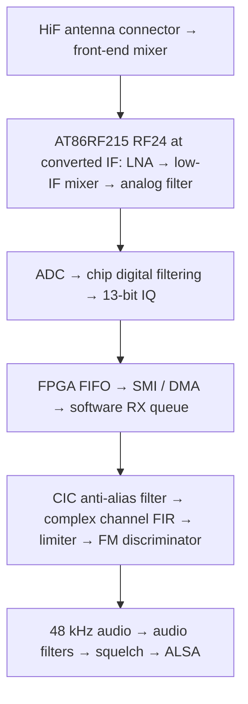

# Menu 14 NBFM RX chain and sensitivity investigation

Recorded 2026-10-10 from source inspection at revision
`60c6138` (`Fix TX-to-RX stream handoff`).

## Deviation configuration (2026-10-10)

The temporary **±5 kHz** experiment has been reverted at the user's request
for their **12.5 kHz channel spacing**. NBFM TX defaults and RX discriminator
normalization again use **±2.5 kHz**, matching the analysis below.

The setting is shared in
[nbfm_defaults.h](../software/libcariboulite/src/nbfm_defaults.h):
`NBFM_DEFAULT_DEVIATION_HZ = 2500.0f`. It applies to TX menus 11/14, the
physical baseline runner, modem self-test, memory demo and the modulator's
NULL-config default, as well as NBFM RX normalization. Explicit caller-supplied
TX deviation values retain their usual meaning.

Noise-squelch RMS thresholds are restored to **0.12/0.18**, with the original
RX PCM and raw discriminator scaling. Filtering, the angle approximation and
the captured IQ are unchanged by this experiment.

After changing the shared constant, rebuild:

```sh
cmake --build build --target cariboulite_test_app nbfm_memory_demo -j2
```

## Investigation context

The user is investigating weak-signal reception in the **menu 14 NBFM receiver
at 430.125 MHz**. The transmitter's actual FM deviation has not been confirmed;
the current receiver normalizes discriminator output for **±2.5 kHz deviation**.

The first software improvement, **complex channel filtering before FM
demodulation**, is now implemented with a **±6 kHz passband** and stopband from
**±9 kHz**. See the [filter design and checks](nbfm-channel-filter.md). The
remaining findings come from source/schematic inspection and calculations.
Antenna-port sensitivity gains have not been measured.

## Current app channel: HiF (RF24)

After the successful S1G listening test, the user requested switching the app
back to **HiF (RF24)**. Menus **11, 12 and 14** now use `sys->radio_high` for
TX and RX. The complex channel filter and ±2.5 kHz normalization remain active.
At 430.125 MHz on the full board, this path uses the HiF front-end mixer and
RF24 at an IF near 2.495 GHz. The driver handles the conversion's IQ inversion.
The direct RF09 antenna-path findings below describe the earlier S1G setup.

## Minimum modem RX bandwidth and explicit AGC (2026-10-10)

Each NBFM RX start now explicitly enables and releases AGC, using the signal
after the modem's digital post-filter. Its **8-sample averaging** and
**−21 dBFS target** match this driver's fresh initialization. The earlier
−30 dBFS description confused the chip's register reset value with the
driver's configured target.

The modem uses its minimum **160 kHz analog bandwidth** and minimum digital
cutoff, **`fS / 8`**. The selected IQ sample rate is retained:

| IQ rate | Analog bandwidth | Digital cutoff | HiF RXBWC / RXDFE |
| --- | --- | --- | --- |
| 1 MS/s | 160 kHz | ±125 kHz | `0x10` / `0x04` |
| 2 MS/s | 160 kHz | ±250 kHz | `0x10` / `0x02` |
| 4 MS/s | 160 kHz | ±500 kHz | `0x10` / `0x01` |

These are the narrowest hardware settings at the supported app rates; the
software **±6 kHz channel filter** still provides NBFM channel selectivity.
The modem IF shift remains enabled, with normal IF polarity. Its internal
low IF follows the selected analog bandwidth; the external HiF conversion
and driver IQ inversion handling remain in use.

Before configuring the frontend, the pipeline stops the modem and confirms
**TRXOFF**. It then reads back the bandwidth, cutoff, sample rate and AGC
controls before enabling RX. A configuration or readback failure prevents RX
startup and permits retry. The profile is reapplied after rate changes,
TX/RX switches and interface loopback. WBFM RX restores the previous wide
2 MHz analog filter and `fS / 2` digital cutoff when it starts.

The policy is local to the app's
[RX pipeline](../software/libcariboulite/src/rx_pipeline.c); generic radio API
and SoapySDR settings are caller-controlled. The user confirmed a successful
listening test with the new modem profile on **HiF (RF24) at 1 MS/s**.
Calibrated sensitivity measurements remain pending.

Hardware-free lifecycle checks pass for RF09 and RF24 at 1/2/4 MS/s, including
stale AGC/filter restoration, NBFM/WBFM transitions and 38 injected configuration
failures or readback mismatches with successful retries. Interface-loopback
checks and the `cariboulite_test_app` build also pass. Reproduce with:

```sh
python3 software/libcariboulite/tests/test_rx_lifecycle.py
python3 software/libcariboulite/tests/test_monitor_loopback.py
cmake --build build --target cariboulite_test_app -j2
```

## Successful listening tests (2026-10-10)

The initial channel-filter test used the **S1G (RF09) channel at 1 MS/s**.

Following implementation of the complex channel filter, the user reported
clearly hearing the repeater's scheduled transmission and understanding its
message. The user described reception as a definite improvement. This records
a successful on-air listening test and a reported improvement in intelligibility.

After switching the app back to **HiF (RF24)**, the user also confirmed
**good reception at 1 MS/s**. Successful listening results are therefore
recorded for both S1G/RF09 and HiF/RF24 with the new complex channel filter.

Following the discriminator angle correction to full `atan2f`, the user
confirmed a further **successful listening test on HiF (RF24) at 1 MS/s**.
This records on-air listening acceptance of the corrected discriminator in
that configuration.

After enabling AGC explicitly and selecting the minimum modem RX bandwidths,
the user again confirmed a **successful listening test on HiF (RF24) at
1 MS/s**. This records on-air listening acceptance with AGC enabled and
unfrozen, **160 kHz analog bandwidth** and **±125 kHz digital cutoff**, together
with the complex channel filter and corrected discriminator.

An RF input level, SINAD result and quantitative sensitivity gain were not
recorded for these tests.

## RX chain



| Stage | Current behavior |
| --- | --- |
| RF frontend | HiF/RF24 path. At **430.125 MHz**, the full board uses its front-end mixer to convert to an IF near **2.495 GHz**. NBFM RX selects **160 kHz modem analog bandwidth**. |
| Chip filtering and rate | IQ runs at **1, 2 or 4 MS/s**, initially 4 MS/s. NBFM uses the minimum chip digital cutoff, **one eighth of the sample rate**. |
| AGC | Explicitly enabled and unfrozen at each NBFM RX start, using the filtered signal, **8-sample averaging** and a **−21 dBFS target**. |
| Transport | FPGA buffers and transfers samples without RX filtering. Software stores signed 13-bit values in 16-bit containers and assembles **10 ms IQ blocks**. |
| Software IQ filtering | Third-order CIC reduces IQ to **200 kS/s**, then a **321-tap complex FIR** filters and decimates to **50 kS/s**. Passband **±6 kHz**; stopband starts at **±9 kHz**. |
| FM detector | Normalizes IQ amplitude and calculates successive-sample phase differences with full **`atan2f`**, returning zero for a zero IQ product. Audio normalization assumes **±2.5 kHz deviation**. |
| Audio | Linear resampling to **48 kHz**, approximately **5 Hz DC rejection**, **50 µs de-emphasis**, a **first-order 3.2 kHz low-pass**, then PCM gain and clipping. Menu 14 defaults to PCM gain 8000. |
| Squelch | Noise squelch defaults **ON**; carrier squelch defaults **OFF**. Enabled detectors must both permit audio. |

The relevant source files are
[menu configuration](../software/libcariboulite/src/app_menu.c),
[radio bandwidth and rate configuration](../software/libcariboulite/src/cariboulite_radio.c),
[RX reader and pipeline](../software/libcariboulite/src/rx_pipeline.c),
[FPGA receive decoding](../firmware/lvds_rx.v),
[NBFM DSP](../software/libcariboulite/src/nbfm_demod_dsp.c), and
[audio processing](../software/libcariboulite/src/fm_audio.h).

## Improvement candidates

### 1. Complex channel filtering (implemented)

The original two averages were mathematically equivalent to one rectangular average of
`RF_rate / 50000` consecutive input samples. Calculating its response gives a
−3 dB point around **±22 kHz**, with a first zero at 50 kHz. At offsets of
**12.5 and 25 kHz**, attenuation is only approximately **0.9 and 3.9 dB**,
respectively, excluding chip filtering.

The new CIC/FIR chain filters before both rate reductions and before the
nonlinear FM detector. For **±2.5 kHz deviation** and **3 kHz voice bandwidth**,
its **±6 kHz** passband provides about **±500 Hz tuning margin** beyond the
5.5 kHz occupied-band estimate. The FIR reaches at least **76.58 dB attenuation**
from **±9 kHz**, and the complete filter adds approximately **0.807 ms delay**.
These are computed filter properties, not measured receiver sensitivity gains.
See the [implementation, tests and limitations](nbfm-channel-filter.md).

### 2. Discriminator angle correction (implemented)

The incorrect `fast_atan2f_small` approximation has been replaced by full
`atan2f`, with a zero-product guard. The former calculation returned about
4.50 radians for a true 2-radian phase difference. The corrected calculation
handles the full circle and restores the wanted modulation's amplitude.

Paired measurements on this Pi found an added **29.5–32.4 µs per 10 ms block**,
or about **0.3 percentage points of one CPU core**. Complete standalone DSP
CPU use is about **2.96%, 3.45% and 4.53%** at **1/2/4 MS/s**. The angle is
calculated only at the post-filter **50 kS/s** rate. See the
[correction, tests and reproducible CPU benchmark](nbfm-discriminator-angle.md).
The user has confirmed successful listening after this correction on
**HiF (RF24) at 1 MS/s**. Calibrated sensitivity measurements remain pending.

### 3. Minimum chip bandwidth and explicit AGC (implemented)

The NBFM RX pipeline now selects the AT86RF215's minimum **160 kHz analog
bandwidth** and **`fS / 8` digital cutoff**, reducing exposure to blockers and
broadband noise before software channel filtering. The hardware filters remain
much wider than NBFM, so software channel filtering is still necessary.

AGC is explicitly enabled and unfrozen with filtered measurement input,
8-sample averaging and a **−21 dBFS target**. This prevents earlier manual gain
or AGC-freeze settings from persisting into an NBFM RX session. The generic
public gain setter still uses different measurement settings and should not
be treated as this app profile. Record the actual AGC/gain registers during
physical comparisons.

The maximum gain-control word also depends on analog bandwidth: 21 at
160–500 kHz, 22 at 630–1000 kHz, and 23 at 1250–2000 kHz. Respect these limits
when testing manual gain; the current public setter clamps only to 23.

See [radio configuration](../software/libcariboulite/src/cariboulite_radio.c) and
the [AT86RF215 datasheet, §§6.2–6.2.5](https://ww1.microchip.com/downloads/aemDocuments/documents/OTH/ProductDocuments/DataSheets/Atmel-42415-WIRELESS-AT86RF215_Datasheet.pdf).

### 4. S1G antenna matching network at 430 MHz (earlier setup)

The [repository schematic, sheets 1 and 7](../hardware/rev2/schematics/CaribouLite.PDF)
shows the direct path through S1G connector J2, series capacitor C22 (15 pF), and
balun **U4 = 0896BM15E0025E** to RF09. Johanson specifies that balun family for
**863–928 MHz**.

Matching and insertion loss at **430.125 MHz** are therefore worth measuring on
the actual board. The available evidence does not establish how much sensitivity
this costs, and the specified in-band insertion loss cannot be assumed at
430 MHz. Confirm the installed component before drawing hardware conclusions.
See [Johanson's specifications](https://www.johansontechnology.com/products/integrated-passives/baluns/0896bm15e0025001e/).

## Measurement baseline and interpretation

1. Disable both squelches in menu 14; verify noise **N** and carrier **C** are
   both OFF.
2. Apply a known FM test signal at **430.125 MHz** with documented modulation
   frequency and deviation.
3. Measure the antenna-port signal level required for a fixed audio quality
   target, such as **12 dB SINAD**. Keep modulation, audio measurement bandwidth,
   gain settings and the test setup fixed across comparisons.
4. Compare changes individually, recording IQ rate, hardware bandwidth,
   AGC/gain registers and any transport or audio errors.
5. Re-evaluate squelch thresholds after changing the channel filter or
   discriminator, because the detector's noise statistics will change.

Sensitivity is the RF input level required for a specified output SINAD; RSSI
alone does not establish it. See
[Keysight's receiver sensitivity measurement note](https://www.keysight.com/zz/en/assets/7018-04671/application-notes/5992-0369.pdf?rd=1).

Carrier squelch currently opens at modem RSSI **−97 dBm** and closes below
**−102 dBm**. It can hide usable weak signals when enabled. Noise squelch measures
discriminator audio before DC rejection, de-emphasis, the voice low-pass and PCM
gain; its thresholds are also separate from demodulation sensitivity. See
[RX squelch](rx-squelch.md).

Sample loss is another possible source of clicks or noise. FPGA, kernel and
application buffers can drop samples, but the RX worker has no complete
discontinuity indication to reset the discriminator across a gap. This is a
transport limitation found in code, not evidence that drops occurred during the
user's reception test. Distinguish continuity problems from an RF sensitivity
limit.

Related context: [monitor tuning and sample rates](monitor-frequency.md),
[audio/DSP interfaces](audio-dsp-interfaces.md), and
[FM architecture and accepted refactoring](demodulator-architecture-research.md).
